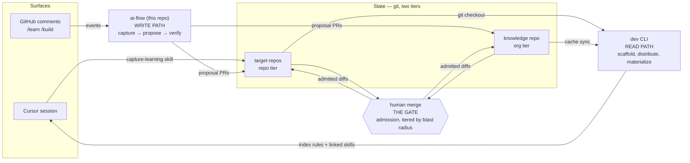

# ai-flow

[codecov](https://codecov.io/gh/d3mlabs/ai-flow)

ai-flow is the organization's learning loop: agents and humans capture
durable lessons from the places work already happens, every lesson enters as
a reviewable proposal, and only what a person merges becomes memory the next
session loads. **This repo is the loop's GitHub control plane** — the slash
commands (`/ask`, `/edit`, `/split`, `/build`, `/learn`), the reusable
workflow that dispatches them to self-hosted runners, and the proposal
checks. Distribution — getting admitted memory onto machines, checkouts, and
sessions — ships inside [d3mlabs/dev](https://github.com/d3mlabs/dev), which
also carries the local plan surface (`dev plan` — Cursor plans sync with
GitHub issues; the issue is the canonical plan).

Comment a slash command on an issue or PR and a GitHub Actions job picks it
up, runs the headless Cursor agent on our own hardware (normal agent
billing, fine model control, warm build environments), and lands the result
back on the comment thread with minimal noise.

## One system, four roles




- **State** is the repos themselves — nothing else holds memory. Two tiers,
one artifact: a *learning* (an index line plus a detail skill) lives in
each target repo (repo tier) or in the org's knowledge repo (org tier).
- **Write path** is this repo: every memory mutation enters as a proposal PR,
from either surface. Capture, proposal, and verification — never admission.
- **The gate** is human merge, tiered by blast radius — the only component
that isn't software.
- **Read path** is `dev`: everything that scaffolds, distributes, and
materializes admitted state onto machines, checkouts, and sessions.
- **Surfaces** — GitHub comments and Cursor sessions — are twins: each is
both a capture entry point and a retrieval endpoint. `/learn` and the
capture-learning skill are the same operation on different surfaces.

How the roles map onto deployment zones is in
[docs/architecture.md](docs/architecture.md); the research argument for the
gate is the paper, [docs/paper.md](docs/paper.md).

## Command surface

Commands are recognized only at the start of a comment line. Quote-reply
(select rendered text, press `r`) is the section anchor — the remote cmd+L.
The consistency rule: `/ask` and `/edit` always operate on the document (the
issue body or the PR description); `/build` always operates on code (open a
PR from an issue, iterate on the branch from a PR); `/learn` always operates
on memory (learning proposal PRs), never the surface's code.


| Command                     | One line                                                                                                                                                                                                             |
| --------------------------- | -------------------------------------------------------------------------------------------------------------------------------------------------------------------------------------------------------------------- |
| `/ask <question>`           | Read-only Q&A against the document + repo; standalone gets a reply, in a batch it lands in place.                                                                                                                    |
| `/edit <instruction>`       | Edits the document as a file through one agent pass and one guarded PATCH, with interleaved results and a collapsed diff.                                                                                            |
| `/split [--dry|--apply]`    | Two-phase plan/apply over sub-issues: `--dry` stages an editable `## Subtasks` yaml spec in the plan body, `--apply` executes it deterministically (per-subtask repo routing, `existing:` adoption); bare does both. |
| `/build` (issue)            | Builds the plan into a PR on branch `ai/<n>-<slug>` — state-aware: refuses on a staged split spec, notes open sub-issues.                                                                                            |
| `/build [instruction]` (PR) | Iterates on the head branch, sweeping unresolved threads + fresh comments; replies per thread with disposition + commit link.                                                                                        |
| `/build --split` (issue)    | Orchestrates `/build` across sub-issues in dependency waves with a live checklist; skips undrivable nodes with warnings.                                                                                             |
| `/learn [statement]`        | Captures durable learnings into a proposal PR — dictated, or a bare sweep of the surface's threads; never touches the surface's code.                                                                                |
| `/learn --scan [context…]`  | Surveys the codebase + docs instead of a discussion: seeds/refreshes architecture digests and distills visible practices.                                                                                            |
| `/learn --promote <slug>`   | Promotes a repo-local learning to the org knowledge repo — paired drafts: the org addition plus the repo-local removal.                                                                                              |


The normative reference — every command per surface, flags, decision
tables, and each refusal message verbatim — is
[docs/commands.md](docs/commands.md). The end-to-end story (author,
canonize, split, build, iterate, close) with all body conventions is
[docs/plan-lifecycle.md](docs/plan-lifecycle.md).

Batches: one comment may hold several quote+command pairs (`/ask`//`/edit`
only) — the review work unit. Noise protocol: acting commands never reply;
the dispatcher edits the command comment in place (👀 reaction while
running); the one exception is a standalone `/ask`, which gets a reply.
While a command runs, the linked Actions run page streams the agent's
activity live — one line per assistant message and tool call.

## The learning loop

LLM weights are frozen pattern-matching: at inference time, in-context
learning is the only learning channel left,[^brown2020] and it evaporates
when the session ends. A skill is in-context learning made durable —
externalized memory that re-enters the context window on demand. ai-flow closes the loop
around that memory, a full learning system with the weights never moving:

1. **Experience.** Learning starts with exposure, and exposure is the cheap
  part — most of what any learner encounters teaches nothing. The loop
   doesn't manufacture experience; it taps the surfaces where the work
   already happens: review threads, build passes, codebase scans.
2. **Credit assignment.** The learning-theory term for the step between
  experience and memory: given a pile of raw experience and an outcome,
   decide which part of it deserves the credit — which specific thing
   caused the result, as opposed to everything that merely happened
   alongside it.[^minsky1961] In RL it's "which of my actions earned this
   reward"; in animal learning, "which of the things I did got me the
   treat."[^thorndike1911] Every learning system has to solve it, because
   raw experience is almost entirely noise. Here the raw experience is a whole review thread or
   build pass — dozens of comments, fixes, renames, decisions — and most of
   it must *not* become memory: a typo fix or a one-off rename is a
   consequence of this diff's circumstances, and writing it down would
   pollute the index. But occasionally a correction reflects a general
   rule — "raise typed errors, never bare strings" — a lesson that would
   have prevented the same mistake in any future PR. The distillation
   rubric every capture pass carries draws exactly that line: does this
   generalize beyond the diff at hand? Most passes yield nothing, by design.
3. **Memory write.** Brains don't archive raw experience; they consolidate
  the distilled trace into durable form while it's fresh.[^mcgaugh2000]
   Same here,
   literally: capture runs while the context is hot — a
   `[/learn](docs/commands.md#learn)` pass, or `/build`'s build-time capture
   in the very pass that held the discussion (on by default;
   `learn: { on_build: false }` in `.github/ai-flow.yml` opts out) — never
   as a cold re-ingest step. The written form is an index line (one
   sentence: the retrieval cue) plus a detail skill (the full lesson),
   landed as a proposal PR.
4. **Behavior change.** A memory only counts if it's retrieved at the
  moment it applies.[^tulving1973] The always-on index rides in every
   session's context
   as the cue list; a detail skill loads on demand when its cue fires; and
   fresh `/build` checkouts get the org's invariants injected into the
   prompt. Retrieval is also observable: every run reports which knowledge
   it actually read (the `knowledge:` lines in the job log and the
   step-summary list) — the usage signal auto-retirement will one day feed
   on, because a memory that is never retrieved is a memory worth
   forgetting.[^bjork1992]

The human gate — every learning lands as a *proposal* PR, merged by a person —
is not training wheels; it is the missing half of learning, supplied from
outside. Humans learn the way the model was trained: by mimicry. An infant
imitates speech and gesture long before understanding either,[^meltzoff1977]
and pre-training is the same move at scale — imitation of human work, frozen
into the weights. But human mimicry never runs open-loop. Every imitation
is scored by a fitness function the learner didn't choose: social cues, a
caregiver's reaction, dopamine's reward-prediction error,[^schultz1997]
gravity when a first step fails — and only imitations that score well get
reinforced. The
model has the mimicry half and none of the scoring: no dopamine, no social
echo, no falling over; its only contact with reality here is CI and review.
The merge gate is that fitness function, abstracted — a person scores each
drafted learning, and only what passes selection becomes durable memory the
next session loads. And because the weights never move, the reinforcement
is selection over external memories rather than synaptic change: closer to
how a culture accumulates knowledge than to how a brain does.[^tomasello1999]

The autonomy trajectory is therefore not "remove the gate" but *replace its
verdicts with cheaper fitness signals as they come online*:
telemetry-driven auto-retirement first (deleting an unused memory is
self-correcting; adding a wrong one is not), tier-scoped auto-merge for
low-blast-radius detail skills behind CI later, convergent evolution — the
same lesson captured independently in two repos — as a self-generated
confidence signal. The always-on index and the org-invariants tier stay
human-merged indefinitely, because taste ("this is how *we* want software
built") is the one fitness signal the loop cannot synthesize. The gate
doesn't disappear; it concentrates where taste lives. (v1 ships only the
full gate; the trajectory is this paragraph, not code.)

Learnings graduate: `/learn --promote <slug>` lifts a repo-local learning to
the org tier — `knowledge_repo:` in `.github/ai-flow.yml` names the org's
knowledge repo — as paired proposals, the org addition and the repo-local
removal that merges after it. Capture passes can initiate the same move
themselves by declaring `PROMOTE: <slug>` in their output — routing changes,
the human gate doesn't. The forms, branch conventions, and the
proposal-tracking rules live in [docs/commands.md](docs/commands.md#learn).

## Layout

Architecture (system diagram, job lifecycle, module map, command flows):
see [docs/architecture.md](docs/architecture.md).

- `.github/workflows/ai-commands.yml` — the reusable workflow (`workflow_call`).
- `bin/dispatch.rb` — job entry point; parses the event, gates, routes.
- `lib/ai_flow/` — comment parsing, anchor resolution, the `Agent#launch`
seam (the one place that invokes the `agent` CLI — swap the backend here),
GitHub API access via `gh`, and the five command implementations.
- `templates/caller-workflow.yml` — the ~10-line workflow each repo copies.
- `templates/hooks.json` — the Cursor `afterFileEdit` auto-push hook for
repos using `dev plan`.
- `docs/` — [commands.md](docs/commands.md) (the normative command
reference), [plan-lifecycle.md](docs/plan-lifecycle.md) (the end-to-end
narrative and body conventions), [architecture.md](docs/architecture.md)
(how it's put together), and [attribution.md](docs/attribution.md) (who
authors what, and why).


## Identity: the ai-flow GitHub App

All GitHub writes (pushes, PRs, comments, body PATCHes) act as the org's
`ai-flow` GitHub App — a per-job token mint, no hosted component. The
comparison that settled it:


|                       | default `GITHUB_TOKEN` | dev PAT                                 | GitHub App                                                                                           |
| --------------------- | ---------------------- | --------------------------------------- | ---------------------------------------------------------------------------------------------------- |
| /build PRs trigger CI | no (by design)         | yes                                     | yes                                                                                                  |
| Acting identity       | `github-actions[bot]`  | the PAT's human — overclaims authorship | `ai-flow[bot]` — truthful                                                                            |
| Expiry / rotation     | per-job, automatic     | 90d ceremony per dev                    | non-expiring key; 1h installation tokens minted lazily per call (long runs outlive any single token) |
| Scope                 | the one repo           | the dev's whole account                 | exactly the repos the App is installed on                                                            |
| Audit trail           | anonymous-ish          | indistinguishable from the human        | first-class bot actor                                                                                |


Setup is a one-time org task: register the App (permissions: contents,
issues, pull requests — read/write; **never** `workflows`, a deliberate
security wall — see [docs/attribution.md](docs/attribution.md)), install it
on participating repos, and store `AI_FLOW_APP_ID` /
`AI_FLOW_APP_PRIVATE_KEY` as org secrets. The App is intrinsic to the
attribution model, so a job without the secrets fails loudly. Adopters who
want to try ai-flow before registering an App can set
`allow_token_fallback: true` to knowingly run degraded on `github.token`
(writes act as `github-actions[bot]`, /build PRs don't trigger CI).

GitHub caps App installation tokens at 1 hour — shorter than a long
`/build` — so the dispatcher never trusts a pre-minted token: the private
key enters the Dispatch step, a `TokenProvider` mints lazily with an age
check on every subprocess spawn, and the write phase (push, comments)
re-mints unconditionally. The key is scrubbed from the environment before
the agent (or any subprocess) starts; the agent only ever sees short-lived
installation tokens, and its own token is downscoped to read-only — every
GitHub write (push, PR, comment) is the dispatcher's, so the agent's token
covers discovery reads across the installation and nothing else. Because
the App lacks the `workflows` scope, `/build`
excludes `.github/workflows/**` from its commits and panels the diff as a
suggested patch for a human — with a human's credential — to apply.

Attribution model (who authors what, and why): see
[docs/attribution.md](docs/attribution.md). Short form — local Cursor work is
dev-authored; web-initiated code work (`/build` on issues and PRs) is
authored by `ai-flow[bot]` with a `Co-authored-by` trailer crediting the
requesting human, whose accountability lives on the PR (`Requested by @login`, PR assignee, merge record).

## Adoption checklist (per repo)

1. Copy `templates/caller-workflow.yml` to `.github/workflows/ai-commands.yml`
  (works for code repos and the org plans repo alike).
2. Ensure the org secrets are available to the repo (or add repo secrets):
  `CURSOR_API_KEY` (authenticates the headless `agent` CLI on the runner)
   and `AI_FLOW_APP_ID` / `AI_FLOW_APP_PRIVATE_KEY` (the ai-flow GitHub App —
   required unless the caller sets `allow_token_fallback: true`). Install
   the App on the repo. Our org secrets use `selected` visibility, so add
   the adopting repo to each secret's repository list (org settings →
   secrets, or `gh secret set <name> --org <org> --visibility selected  --repos <list>`). Note `private` visibility excludes public repos  entirely — a public caller's job fails at the "Require the ai-flow App"spl  step until the secret is shared with it.
3. Register self-hosted runners with the per-command labels the workflow
  routes on: `ai-ask`, `ai-edit`, `ai-split`, `ai-build`, `ai-learn`. The
   topology is a deployment choice — one box can carry all five labels, or a
   beefy box takes `ai-build` alone (/build runs the full agent loop
   including tests, so it needs a real dev machine, not a bare runner) while
   a light box takes the rest. One registered runner instance = one concurrent job;
   register N instances for N parallel jobs. Repos using `dev` can run
   `dev runner-setup`.
4. Install the Cursor `agent` CLI on each runner (`curl https://cursor.com/install -fsS | bash`)
  and make sure it — plus `dev`, rbenv, and shadowenv — is on the runner
   service's PATH. Ruby itself and the dispatcher's gems are not
   prerequisites: the workflow runs `dev install-deps` in the ai-flow
   checkout, which provisions the pinned Ruby (an rbenv install, one-time
   per box) and the locked gem set from `dependencies.rb`.
5. Optional: copy `templates/ai-flow.yml` to `.github/ai-flow.yml` to set
  model policy (`models.default`, per-command overrides — see
   [docs/architecture.md](docs/architecture.md#per-repo-config-githubai-flowyml));
   valid names come from `agent --list-models`, which every run also prints
   in its job log. Without the file, the agent CLI's account default applies.
   The same file carries the learning-loop keys: `knowledge_repo:` (the org
   knowledge repo `--promote` targets) and `learn: { on_build: false }` (opt
   out of `/build`'s capture pass).
6. Optional: copy `templates/hooks.json` to `.cursor/hooks.json` for plan
  auto-push via `dev plan`.

Configuration inputs (set in the caller workflow's `with:`): `command_prefix`
(default none; set e.g. `ai-` if you run other slash-command bots),
`per_actor_runners` (multi-dev orgs: route every job to the commenter's own
runner, labeled `dev-<login>`, instead of the shared pools — compute scoping
without shared hardware; per-dev runner registration tooling is deliberately
deferred), and `allow_token_fallback` (explicit opt-in to run without the
App). Runner labels are deliberately not configurable (convention over
configuration), and model policy lives in `.github/ai-flow.yml`, not in
workflow inputs — inputs are scalar-only, and the config file keeps the
caller workflow an untouched copy-paste.

Why self-hosted runners are the contract (not just our preference): (a) warm
machines — engine toolchains, derived-data caches, checkouts, and the agent
CLI stay resident, where ephemeral hosted runners start cold every command;
(b) billing — GitHub's standard hosted runners are free on public repos but
too small for build workloads (2-core/7GB/14GB SSD), and larger runners bill
even on public repos (Linux 8-core $0.032/min, 16-core $0.064/min — a 30-min
/build on 16-core is ~$1.92/run, ~$288/mo at 150 runs, vs $0 marginal on
boxes we already own); (c) model control — the CLI exposes the full
`--list-models` menu including parameterized bracket overrides, where Cursor
Cloud Agents run a curated model subset at API pricing. Hosted-runner mode
(a CLI install step plus a routing escape hatch) is a possible future
feature, not a current one — today a job on a runner without the agent CLI
fails at the first agent invocation.

Shareability: if this repo is public, any org can reference
`d3mlabs/ai-flow/.github/workflows/ai-commands.yml@main` with its own secret
and runner pool (same distribution model as action repos, one level up).
Callers reference `@main` deliberately: the dispatcher
checkout inside the workflow always runs main, so pinning the YAML to a tag
or SHA would only freeze half the system and silently split the two versions.

### Public repos

A public caller repo on self-hosted runners is the combination GitHub
cautions against — and d3mlabs runs it live (`d3mlabs/dev`), so this
subsection is the reference deployment, not theory. The workflow ships two
guards every adopter inherits: a Bot-type filter on the job conditions
(the bot's own replies never spawn runs) and a hosted `authorize` job that
checks the command author's repo permission on free hosted seconds, before
any self-hosted second — unauthorized commands die there, and the
dispatcher's in-Ruby fail-closed gate stays as defense-in-depth. Prompts
are provenance-filtered too: auto-ingested context (review threads,
discussion comments, origin replays) only carries content from
write-authorized authors — a maintainer includes third-party feedback by
quoting it — and every assembled prompt prints in the run log. See
[docs/architecture.md](docs/architecture.md#public-repo-posture) for the
threat mechanics.

The org/repo settings are the adopter's half, and for a public caller they
are required, not suggested:

- **Fork-PR approval: "require approval for all outside collaborators"**
(org or repo Actions setting). Some event types run the *head* branch's
workflow file, so unreviewed fork YAML must never execute.
- **Runner group restriction**: visibility `selected` with only adopting
repos, and `restricted_to_workflows` pinned to
`d3mlabs/ai-flow/.github/workflows/ai-commands.yml@main` (jobs defined
in a reusable workflow are checked against the reusable workflow's
path/ref). Even an accidentally approved malicious fork workflow then
gets no self-hosted runner.
- **CODEOWNERS + required review on the workflow path**: the pin makes
`ai-commands.yml@main` the runner group's root of trust, so
`.github/workflows/**` needs a required human review — note PR authors
can't approve their own PRs but *can* approve bot-authored ones, which
is exactly the case that matters (a `/build` proposing workflow changes
must not become runner-trusted on a casual merge). Mirroring the same
entry on adopters' own `.github/workflows/` guards the caller's
conditions from quiet loosening.

Rotation note: the App private key transits the runner host in the
token-mint step, so treat a runner-host compromise as an App-key rotation
event.

## Development

```sh
dev up         # provision the pinned Ruby + install locked gems
dev test       # run the suite
dev typecheck  # sorbet static typecheck
```

The runtime dependency surface is deliberately thin: `sorbet-runtime` (the
sigs and sealed hierarchies check at runtime too) plus shell-outs to `gh`,
`git`, and `agent`; everything else is development- or test-only. Tests fake
exactly those subprocess boundaries and exercise everything else for real.

[^brown2020]: Tom B. Brown et al., "Language Models are Few-Shot Learners,"
    *Advances in Neural Information Processing Systems 33* (2020) — the
    demonstration that a frozen-weights model learns tasks from examples in
    its context window, and only for as long as they stay there.
[^minsky1961]: Marvin Minsky, "Steps Toward Artificial Intelligence,"
    *Proceedings of the IRE* 49:1 (1961), which names the credit-assignment
    problem; its temporal form is a central thread of Richard S. Sutton and
    Andrew G. Barto, *Reinforcement Learning: An Introduction*, 2nd ed.
    (MIT Press, 2018).
[^thorndike1911]: Edward L. Thorndike, *Animal Intelligence: Experimental
    Studies* (Macmillan, 1911) — the law of effect: responses followed by
    satisfaction are strengthened, which presupposes knowing *which*
    response to strengthen.
[^mcgaugh2000]: James L. McGaugh, "Memory — a Century of Consolidation,"
    *Science* 287:5451 (2000): new memories are labile and consolidate over
    time. On why the durable store is written *from* the fresh trace rather
    than by re-ingesting raw experience, see James L. McClelland, Bruce L.
    McNaughton, and Randall C. O'Reilly, "Why There Are Complementary
    Learning Systems in the Hippocampus and Neocortex," *Psychological
    Review* 102:3 (1995).
[^tulving1973]: Endel Tulving and Donald M. Thomson, "Encoding Specificity
    and Retrieval Processes in Episodic Memory," *Psychological Review*
    80:5 (1973) — what a memory does for you depends on the retrieval cues
    available when you need it.
[^bjork1992]: Robert A. Bjork and Elizabeth L. Bjork, "A New Theory of
    Disuse and an Old Theory of Stimulus Fluctuation," in *From Learning
    Processes to Cognitive Processes: Essays in Honor of William K. Estes*,
    vol. 2 (Erlbaum, 1992) — retrieval strength decays with disuse, and
    that decay is adaptive, not a defect.
[^meltzoff1977]: Andrew N. Meltzoff and M. Keith Moore, "Imitation of
    Facial and Manual Gestures by Human Neonates," *Science* 198:4312
    (1977); the broader observational-learning framework is Albert Bandura,
    *Social Learning Theory* (Prentice Hall, 1977).
[^schultz1997]: Wolfram Schultz, Peter Dayan, and P. Read Montague, "A
    Neural Substrate of Prediction and Reward," *Science* 275:5306 (1997) —
    midbrain dopamine neurons encode reward-prediction error, the same
    quantity temporal-difference learning formalizes.
[^tomasello1999]: Michael Tomasello, *The Cultural Origins of Human
    Cognition* (Harvard University Press, 1999) — cumulative culture (the
    "ratchet effect"): knowledge accumulates through transmission and
    selection across individuals, without any individual brain rewiring to
    hold it all.