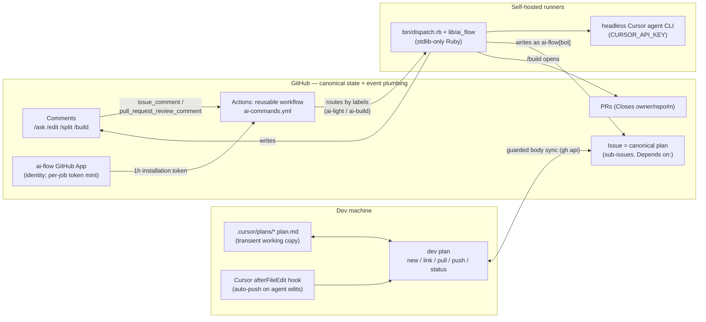
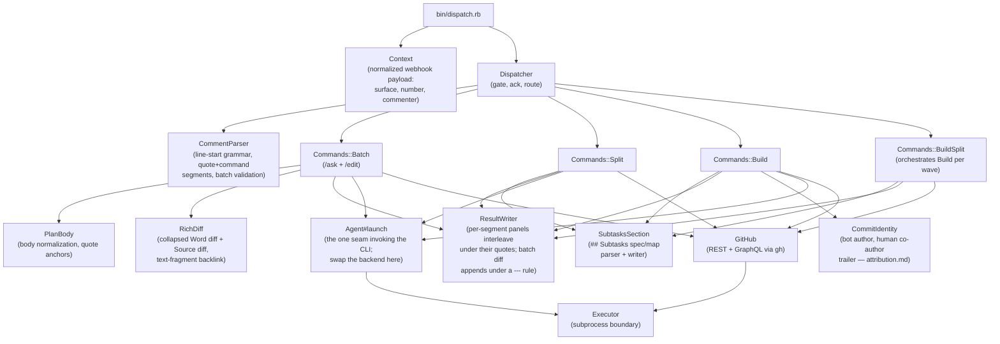
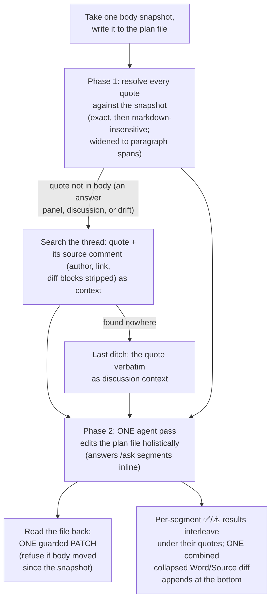
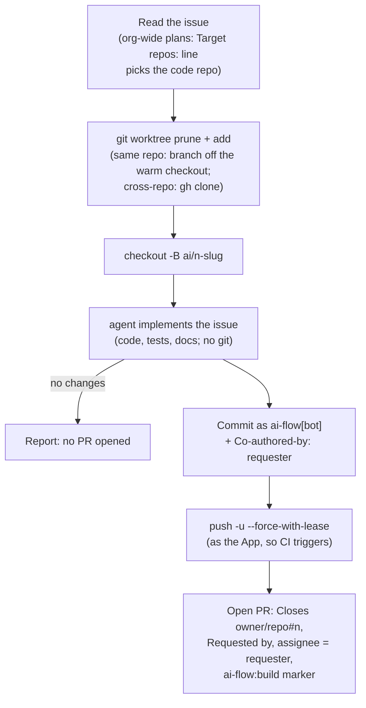
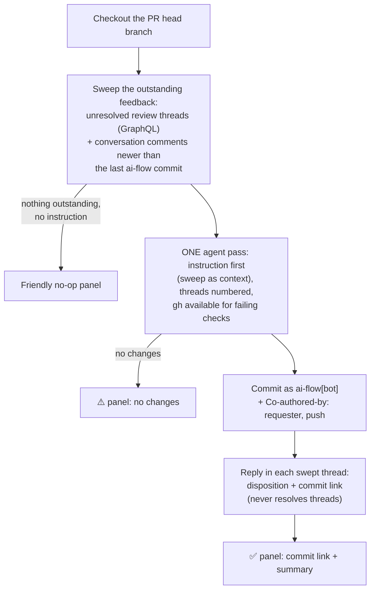

# Architecture

How ai-flow is put together: the system's three halves, what happens between
a slash-command comment and its in-place result, and how the Ruby dispatcher
is structured. Command semantics per surface (flags, decision tables,
refusals) live in [commands.md](commands.md); the end-to-end plan story and
body conventions in [plan-lifecycle.md](plan-lifecycle.md); identity and
authorship in [attribution.md](attribution.md).

## System overview

Three zones. The dev's machine holds the transient working copy (Cursor
plans synced by `dev plan`); GitHub holds the canonical state (issues are
the plans) and operates all event plumbing; self-hosted runners do the
thinking (the headless Cursor agent) and the writing (as the ai-flow App).



Division of labor, and why:

- **GitHub Actions is the dispatcher infrastructure** — webhook consumption,
  queueing, and routing are operated by GitHub and cost nothing on
  self-hosted runners. There is no always-on service anywhere in ai-flow.
- **Self-hosted runners are the execution layer** — normal agent billing,
  per-command model control (`Agent::MODELS`), and warm dev environments
  for `/build`.
- **The GitHub App is identity only** — no hosted component; the workflow
  mints a short-lived installation token each job. App tokens (unlike the
  default `GITHUB_TOKEN`) trigger downstream workflows, which is what gives
  /build PRs their CI runs.

## Job lifecycle

From comment to in-place result:

```mermaid
sequenceDiagram
    participant Human
    participant GitHub
    participant Workflow as ai-commands.yml (runner)
    participant Dispatcher as dispatch.rb
    participant Agent as agent CLI

    Human->>GitHub: comment "/edit tighten this section"
    GitHub->>Workflow: issue_comment event (job-level if filter passed)
    Note over Workflow: ack job (GitHub-hosted, outside the<br/>concurrency group) reacts 👀 within<br/>seconds, before dispatch even starts
    Note over Workflow: runs-on picks the pool:<br/>/build to ai-build, rest to ai-light<br/>(or dev-login when per_actor_runners)
    Workflow->>GitHub: mint App installation token (required)
    Workflow->>Workflow: checkout target repo + ai-flow
    Workflow->>Dispatcher: ruby dispatch.rb (GH_TOKEN = App token)
    Dispatcher->>Dispatcher: re-parse grammar + permission gate
    Dispatcher->>GitHub: react with eyes (deduped backstop of the ack job)
    Dispatcher->>GitHub: append "⏳ follow the run" status line to the comment
    Dispatcher->>Agent: prompt (workdir = checkout or worktree)
    Agent-->>Dispatcher: result text
    Dispatcher->>GitHub: guarded writes (body PATCH, push, PR, sub-issues)
    Dispatcher->>GitHub: edit the command comment with interleaved results + diff<br/>(replaces the ⏳ line; run link stays as a ⚙️ footer)
```

Two deliberate layers of filtering: the workflow-level `if` is a coarse
`contains()` check so non-command comments never start a job; the Ruby
dispatcher re-checks the exact line-start grammar and the permission gate
(`OWNER`/`MEMBER`/`COLLABORATOR`), exiting quietly on prose mentions. A
`concurrency` group serializes jobs per issue/PR, because batches assume a
stable body snapshot.

The noise protocol shapes every write: acting commands never reply. The
dispatcher appends results into the command comment itself
(`ResultWriter`), so one comment carries both the ask and the outcome. The
single exception is a standalone `/ask`, which gets a reply comment —
a question and answer is a legitimate two-comment conversation.

## Dispatcher module map

Everything under `lib/ai_flow/`, stdlib-only at runtime. The two injectable
boundaries are `Executor` (every subprocess: `gh`, `git`, `agent`) and the
classes built on it — tests fake exactly those and run everything else for
real.



Routing rules (in `Dispatcher#route`): a comment whose segments are all
`/ask`//`/edit` runs as one `Batch` — the review work unit. `/split` and
`/build` are lifecycle operations and must be a comment's only command
(enforced by `CommentParser#validate!`); `/build --split` goes to the
orchestrator (and is refused on PRs). `/split`'s `--dry`/`--apply` flags
are resolved inside `Commands::Split`; the staged proposal lives in the
plan body as the `## Subtasks` section (`SubtasksSection` owns its
format — see [commands.md](commands.md)).

The command-surface consistency rule: `/ask` and `/edit` always operate on
the document — the issue body or the PR description (the issues API covers
both, so `Batch` has one flow). `/build` always operates on code: on an
issue it opens a PR; on a PR (top-level comments only) it iterates on the
head branch, sweeping unresolved review threads and fresh conversation
comments as its scope and replying in each swept thread with a disposition
and the commit link. A `/build` posted inside a review thread is refused
with a pointer to the conversation.

## The batch two-phase flow

Document editing is file-based, mirroring a Cursor chat message with
several cmd+L selections: quotes are focus anchors, not edit boundaries —
the agent owns the whole document's consistency and an instruction's
implications land wherever the document needs them. One comment is one
unit of change. A batch launched from a review thread carries the thread's
line anchor (path + diff hunk) as context; the document stays the target.



## The /build flow

On an issue, `/build` runs the agent in a disposable worktree so concurrent
builds never share a workspace, then authors the PR itself — deterministic
back-references, not agent-written ones:



On an issue, `/build` first reads the split state: a staged (unapplied)
`## Subtasks` spec is a refusal, open sub-issues are a note on the result
panel (decision table in [commands.md](commands.md)).

Sub-issues carry thin bodies (the parent plan is the spec), so on a
sub-issue the prompt reconstructs the subtask's scope: `GitHub#parent_issue`
resolves the native parent relationship via GraphQL, the parent's body
rides along as `<<<PARENT PLAN>>>`, and the sibling subtask titles are
listed as explicitly out of scope.

`/build --split` wraps this: it reads the parent's native sub-issues,
topologically sorts them by their `Depends on: owner/repo#n` lines into
waves, runs `Build#build_issue` per sub-issue, ensures a final integration
sub-issue exists, and reports a live per-wave checklist edited in place.
Nodes it cannot drive — intended-repo fallbacks and adopted/referenced
external issues (read from the applied `## Subtasks` map) — are skipped
with explicit warnings, and their dependents (including anything depending
on an open issue outside the set) are reported blocked.

On a PR, `/build` iterates on the head branch in the job checkout instead:



## Extension points

- **Agent backend**: `Agent#launch` is the single seam that invokes the
  `agent` CLI — an alternative backend (cloud REST API, another vendor's
  CLI) is a change here, not in the command scripts.
- **Model policy**: `Agent::MODELS` maps command to model; `AI_FLOW_MODEL`
  overrides per run.
- **Runner routing**: `light_runner_labels` / `build_runner_labels` inputs,
  or `per_actor_runners` for per-dev pools.
- **Command prefix**: `command_prefix` input for orgs with clashing
  slash-command bots.
- **Identity**: the App secrets; the bot login self-configures from the
  App's slug (`AI_FLOW_BOT_LOGIN`).
