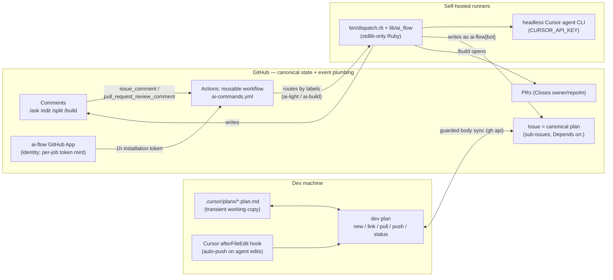
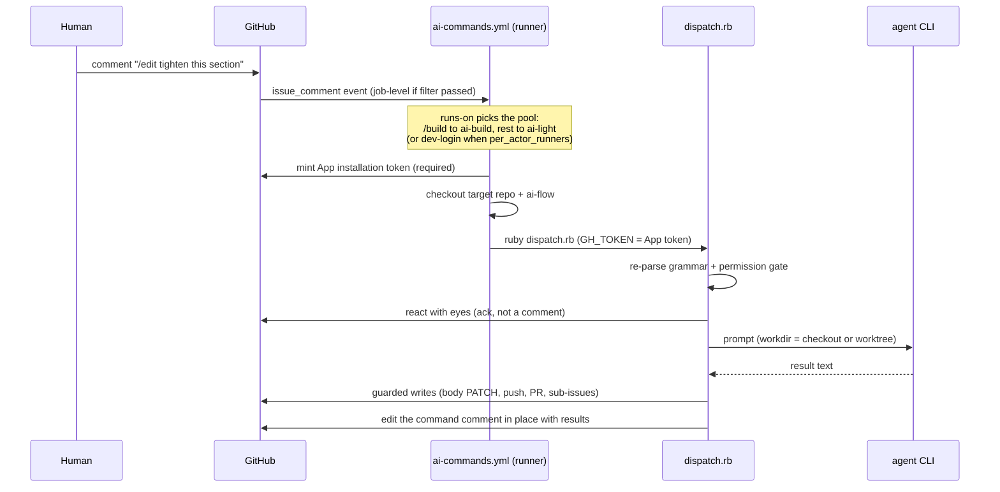
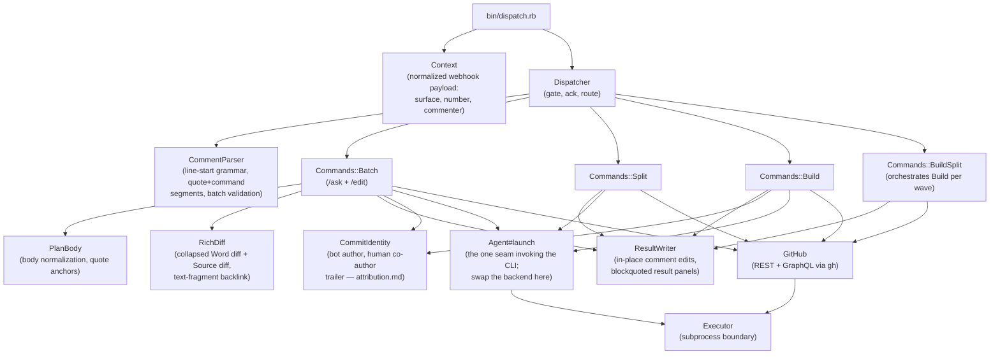
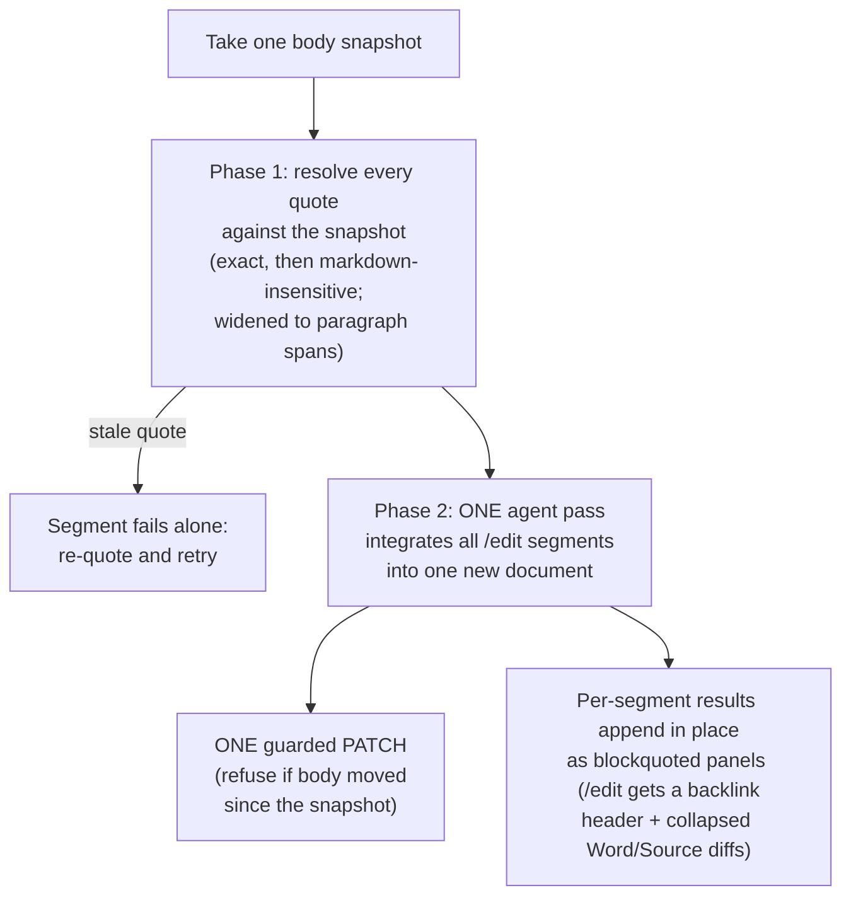
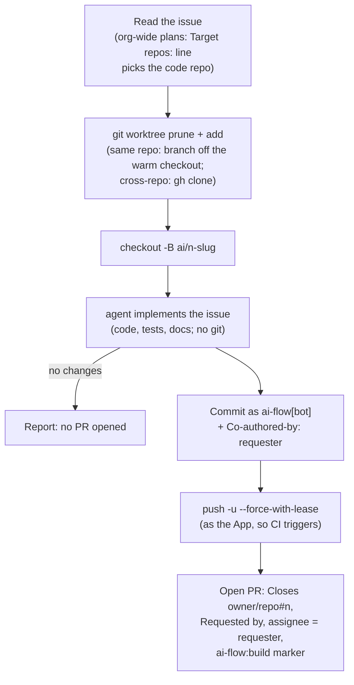

# Architecture

How ai-flow is put together: the system's three halves, what happens between
a slash-command comment and its in-place result, and how the Ruby dispatcher
is structured. Identity and authorship live in their own doc —
[attribution.md](attribution.md).

## System overview

Three zones. The dev's machine holds the transient working copy (Cursor
plans synced by `dev plan`); GitHub holds the canonical state (issues are
the plans) and operates all event plumbing; self-hosted runners do the
thinking (the headless Cursor agent) and the writing (as the ai-flow App).

Division of labor, and why:

- **GitHub Actions is the dispatcher infrastructure** — webhook consumption,
  queueing, and routing are operated by GitHub and cost nothing on
  self-hosted runners. There is no always-on service anywhere in ai-flow.
- **Self-hosted runners are the execution layer** — normal agent billing,
  per-command model control (`Agent::MODELS`), and warm dev environments
  for `/build`.
- **The GitHub App is identity only** — no hosted component; the workflow
  mints a short-lived installation token each job. App tokens (unlike the
  default `GITHUB_TOKEN`) trigger downstream workflows, which is what gives
  /build PRs their CI runs.

## Job lifecycle

From comment to in-place result:

Two deliberate layers of filtering: the workflow-level `if` is a coarse
`contains()` check so non-command comments never start a job; the Ruby
dispatcher re-checks the exact line-start grammar and the permission gate
(`OWNER`/`MEMBER`/`COLLABORATOR`), exiting quietly on prose mentions. A
`concurrency` group serializes jobs per issue/PR, because batches assume a
stable body snapshot.

The noise protocol shapes every write: acting commands never reply. The
dispatcher appends results into the command comment itself
(`ResultWriter`), so one comment carries both the ask and the outcome. The
single exception is a standalone `/ask`, which gets a reply comment —
a question and answer is a legitimate two-comment conversation.

## Dispatcher module map

Everything under `lib/ai_flow/`, stdlib-only at runtime. The two injectable
boundaries are `Executor` (every subprocess: `gh`, `git`, `agent`) and the
classes built on it — tests fake exactly those and run everything else for
real.

Routing rules (in `Dispatcher#route`): a comment whose segments are all
`/ask`//`/edit` runs as one `Batch` — the review work unit. `/split` and
`/build` are lifecycle operations and must be a comment's only command
(enforced by `CommentParser#validate!`); `/build --split` goes to the
orchestrator.

## The batch two-phase flow

Every quote in a batch was taken against the same rendered body the
reviewer read, so segments must never be invalidated by their siblings'
edits:

## The /build flow

`/build` runs the agent in a disposable worktree so concurrent builds never
share a workspace, then authors the PR itself — deterministic
back-references, not agent-written ones:

`/build --split` wraps this: it reads the parent's native sub-issues,
topologically sorts them by their `Depends on: #n` lines into waves, runs
`Build#build_issue` per sub-issue, ensures a final integration sub-issue
exists, and reports a live per-wave checklist edited in place.

## Extension points

- **Agent backend**: `Agent#launch` is the single seam that invokes the
  `agent` CLI — an alternative backend (cloud REST API, another vendor's
  CLI) is a change here, not in the command scripts.
- **Model policy**: `Agent::MODELS` maps command to model; `AI_FLOW_MODEL`
  overrides per run.
- **Runner routing**: `light_runner_labels` / `build_runner_labels` inputs,
  or `per_actor_runners` for per-dev pools.
- **Command prefix**: `command_prefix` input for orgs with clashing
  slash-command bots.
- **Identity**: the App secrets; the bot login self-configures from the
  App's slug (`AI_FLOW_BOT_LOGIN`).
