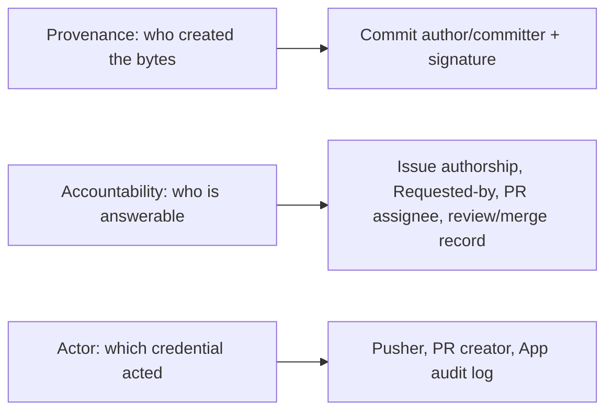
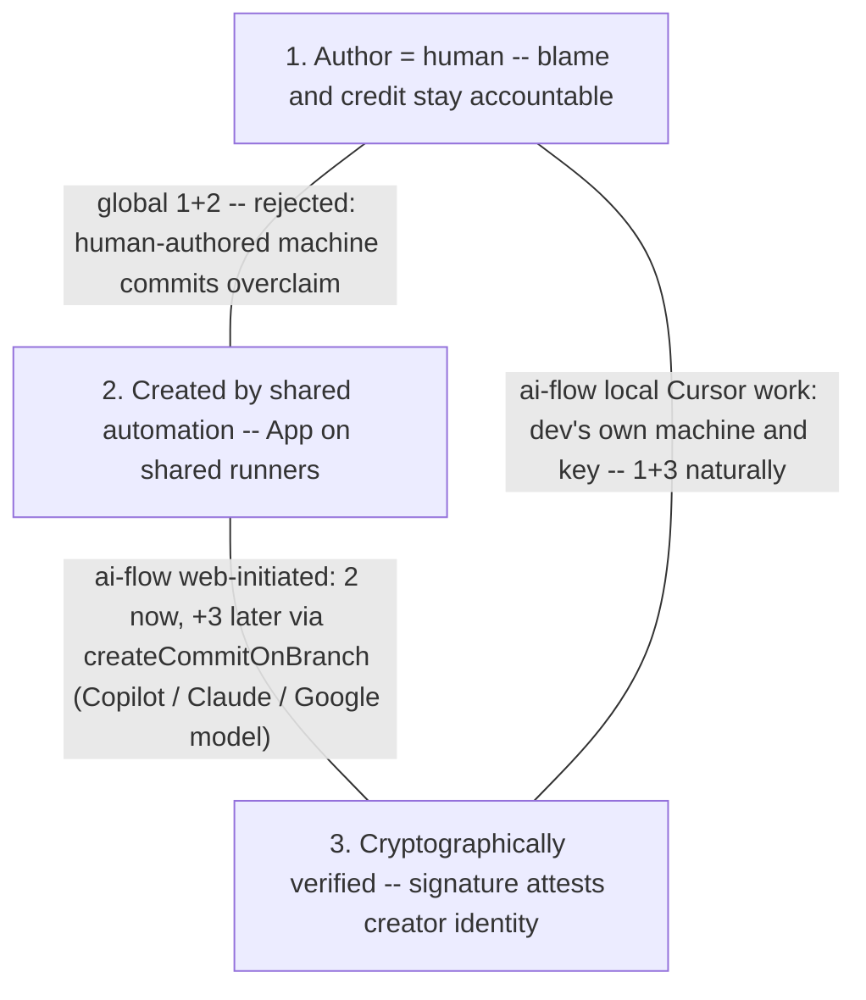

# Attribution

Who authors what when ai-flow acts, and why. This is the design record for
the identity model the workflows and command scripts implement.

## The three questions

"Attribution" bundles three questions that different git/GitHub surfaces
answer, and most of the confusion in this space comes from making one
surface answer another surface's question:

1. **Provenance** — who or what created these bytes, in what context?
2. **Accountability** — who wanted this change, who is answerable for it,
   who approved shipping it?
3. **Actor** — which credential performed each API write (audit trail)?



## The two flows

ai-flow partitions attribution per flow, not globally:

| Surface | Local Cursor work | Web-initiated work (/build on issues and PRs) |
|---|---|---|
| Commit author + committer | the dev (their git identity) | `ai-flow[bot]` |
| Commit trailer | none | `Co-authored-by: <login> <id+login@users.noreply.github.com>` (the requesting human) |
| Commit signature | dev's key, if they sign | unsigned now; GitHub-signed later via `createCommitOnBranch` |
| Pusher / PR creator | the dev, own auth | the ai-flow GitHub App |
| PR body | — | `Requested by @<login>` + `Closes owner/repo#n` + ai-flow marker |
| PR assignee | the dev | the requesting human |
| Merge approval | the dev / a reviewer | the requesting human (or a reviewer) |

Local work never touches ai-flow: no App, no bot, nothing to configure. The
dev authored every line by accepting it in-session; they are simply the
author.

Web-initiated work is authored by the machine because that is what happened:
the human specified intent (the issue), requested execution (the command
comment), and reviews the result (the PR) — but never touched the lines. The
human's contribution lives where it actually happened, at the PR and issue
layer, at full strength.

Mixed branches are fine and truthful: a /build PR the dev then amends locally
carries bot commits and dev commits side by side, each recording its own
creation context.

## The two granularities (why the trilemma dissolves)

A commit surfaces three desirable properties, and the signature math lets
you pick only two — a signature can only attest the identity of whoever
*created* the commit, so proof and authorship claim must name the same
entity:

1. **Author = the requesting human** — blame, credit, and accountability
   stay on the person who orchestrated and merges the work.
2. **Commits created by shared automation** — the App on shared runners;
   convenient, centralized, no per-dev infra.
3. **Cryptographic verification** — the Verified badge; the commit provably
   came from the named identity.



The dissolution: attribution has two granularities, and the trilemma only
binds one of them.

- **Commit-level attribution** is the *creation record*: who/what produced
  these lines, in which context. This is the layer the signature math
  constrains (proof must name the creator), so it is where the pick-two
  triangle lives. It is honestly answered per creation context — bot for
  web-initiated work, dev for local work.
- **PR-level attribution** is the *accountability record*: who wanted this,
  who is answerable, who approved shipping it. It is completely
  unconstrained by signing — `Requested by @login`, the PR assignee, the
  linked issue the human authored, the review/merge approval. Human
  attribution lives here at full strength no matter what the commit layer
  says.

The trilemma felt forcing only while the commit layer was asked to carry the
accountability story. Once each layer answers its own question, no
corner-pair sacrifice is needed globally: local work gets 1+3 naturally
(dev's machine, dev's key), web-initiated work gets 2 now and 2+3 later.

### Rejected alternatives

- **Global 1+2** (human-authored bot commits — e.g. a dev PAT on the
  runner): claims a comprehension-by-creation the human doesn't have, and if
  the shared credential ever leaks, an attacker can push code attributed to
  any human — the commit graph stops being trustworthy evidence while the
  author field keeps pointing at innocents.
- **1+3 via per-dev signing runners**: honest, but convoluted — signing-key
  access wired into runner services, jobs queuing while a dev's box is
  offline, per-dev infrastructure — all to preserve an authorship claim the
  flow split shows was miscast in the first place.

### Signing, phased

/build commits ship unsigned today (plain git in the worktree — corner 2
without 3). If signed-commit enforcement ever arrives, the upgrade is to
create commits through GitHub's GraphQL `createCommitOnBranch`, which GitHub
signs automatically as the App's bot (the Copilot / Claude / Google
coding-agent model): bot commits become Verified, local dev commits are
signed by devs, every commit verified, no impersonation anywhere. Until
then, a push to a signing-enforced branch fails loudly and the failure
surfaces in the command comment.

## Credit: the human co-author trailer

Web-initiated commits carry one trailer:

```text
Co-authored-by: <login> <id+login@users.noreply.github.com>
```

naming the requesting human (the `<id>+<login>` noreply form links reliably
for all accounts; the plain `login@` form predates 2017 accounts). This is a
credit annotation on a machine surface: it restores contribution-graph
credit for orchestrated work and renders both avatars on the commit, without
disturbing the truthful bot author field.

AI trailers are never used, in either flow.

## Landscape: why we flip the trailer direction

The dominant tooling pattern is the opposite of ours — AI trailers on
human-authored commits:

- *Claude Code* (local CLI) auto-appends `Co-authored-by: Claude` to commits
  the dev authors; *Copilot CLI* does the same (`Co-authored-by: Copilot`).
- *VS Code* flipped its `git.addAICoAuthor` default to on in spring 2026,
  misattributed hand-written code due to detection bugs, and reverted after
  community backlash — evidence the pattern is both contested and
  unmeasurable at the boundary.
- On web-initiated work the industry matches us: *Copilot coding agent* and
  *claude-code-action* commit under bot identities.

Vendors put AI trailers on human commits because AI-assistance telemetry
("X% of code AI-assisted") serves adoption metrics and org-level policy
tracking, and the trailer is the only commit-level slot that doesn't break
authorship. We reject it because locally the AI is a tool — we don't
annotate tool use into history any more than we'd add
`Co-authored-by: IntelliSense`. The dev authored the change by accepting
every line in-session, and in 2026 "AI-touched" approaches 100% of lines, so
the signal is noise (the VS Code fiasco showed even the detection boundary
is fiction).

Our trailer direction — human credit on bot commits — annotates
*accountability and credit*, which is measurable, meaningful, and exactly
what the surface is for. Provenance for orchestrated work needs no trailer
because it is structural: the `ai/` branch prefix, the bot author/committer,
the bot PR author, the `<!-- ai-flow:build -->` marker, the App audit trail.
If we ever want "how much of the codebase was orchestrated" metrics, those
structural surfaces make it a query, not trailer archaeology.

## Accountability in practice

The invariant is "the human is answerable": they authored the issue, typed
the command, are named and assigned on the PR, and merged it. Blame → PR →
issue archaeology carries the human context. This is socially enforced — the
merger is answerable for comprehension on demand — and surfaced through the
normal chain: if people keep coming to you with questions about code you
merged and you don't have answers, that is visible.
