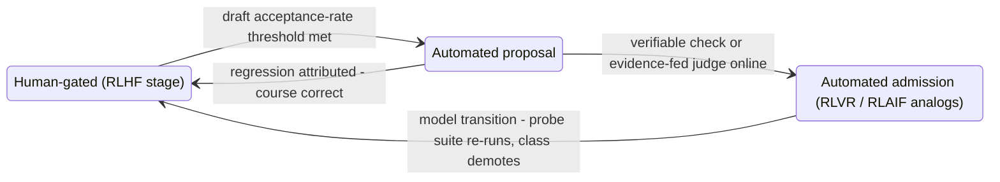
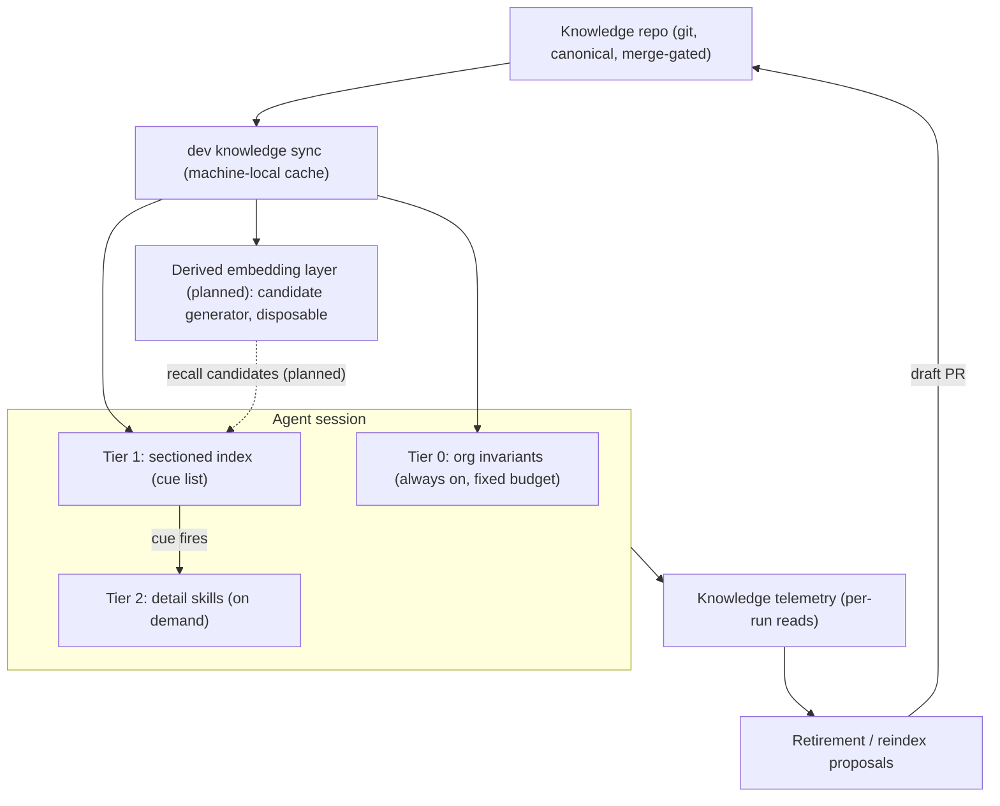
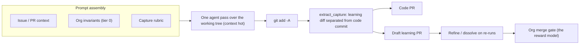

# The Merge Gate Is the Reward Model: Gradient-Free Organizational Post-Training for LLM Agents

*d3mlabs, July 2026 — working paper*

## Abstract

Organizations deploying LLM agents suffer session amnesia at organizational scope: every session starts from the same frozen weights and an empty context, so the same review corrections recur pull request after pull request, repository after repository. The field's response — externalized memory and skill libraries — has converged on a common artifact lifecycle (propose, admit, retrieve, retire) but ships it as ungoverned, model-coupled infrastructure: admission is automatic or absent, and retrieval structure mutates as an unreviewed background job. We describe **ai-flow**, a GitHub-native learning loop built on a different premise: the organization's existing code-governance machinery — draft pull requests, human review, merge gates, revert — is the correct substrate for the *entire* memory system, and the organization's review conversation is the correct capture surface. We argue the system is best understood as **gradient-free post-training scoped to the organization**: a PR review thread is a preference pair with the critique attached — the datum RLHF pays annotators to produce, generated for free, plus the rationale RLHF discards; the update rule is a gated memory write instead of a gradient step; and the reward model is the organization's own judgment, never distilled into an optimizable proxy, so reward-model over-optimization is structurally absent. Automation advances along a **graduation ladder** that mirrors the field's own RLHF → RLAIF → RLVR progression, with one property we believe is unique among deployed systems: the ladder is **re-entrant** — graduation never removes a gate, only automates passing it, so a model transition demotes diff classes back to human review and re-graduates them as compatibility checks re-pass. We ground each design choice in the preference-learning, agent-memory, knowledge-management, and deployment-governance literature; report the deployment's early state honestly (the corpus is young and our own numbers are descriptive, not causal); state what is inherited versus novel; and define the measurement agenda that makes the claims falsifiable.

---

## 1. Introduction

### 1.1 The problem

What an engineering organization accumulates — taste, conventions, architectural constraints, process rules — currently lives in review comments that evaporate on merge. LLM agents amplify the loss: a frozen-weights model relearns nothing between sessions [1], so an organization's agents repeat the same corrected mistakes indefinitely. The two obvious remedies fail in complementary ways. Per-organization fine-tuning is operationally impractical, risks degrading general capability, and freezes the wrong thing — yesterday's conventions, baked into weights that cannot be selectively reverted. Longer context windows do not solve it either: the lesson must be *distilled and placed*, not merely present somewhere in a million tokens.

The problem is not new, and its pre-LLM history is the null hypothesis this work must overcome. Software engineering ran a decades-long experiment in organizational memory — Basili's Experience Factory institutionalized the capture-package-reuse loop [33], and "lessons learned" systems were deployed across military and industrial organizations — with a well-documented failure mode: repositories became write-only graveyards. The survey literature identifies the two killing parameters precisely: capture is friction (engineers do not stop to write lessons), and retrieval never happens at the moment of need — Weber, Aha and Becerra-Fernandez name the latter the *lesson distribution gap*, observing that passive repositories fail because they "lack effective methods for delivering lessons to potential users to support decision-making" [34]. Their prescribed fix, two decades early, was *monitored distribution*: software that matches lessons to the user's context and pushes them unprompted.

Our claim is that LLM agents change exactly those two parameters and no others. Capture cost falls to near zero because the agent — already inside the work with the full context — writes the lesson; the human's remaining cost is a merge decision. Retrieval becomes machine-executed and observable: an index of retrieval cues rides in every session by construction, the model reads it every time, and telemetry records what was actually retrieved. The organizational-memory loop that failed on human parameters is re-run on machine parameters. Whether that is sufficient is an empirical question (Sections 12, 15); the design is built so the question is measurable.

The research community's parallel answer is externalization: memory stores for state across time, skill libraries for procedural expertise, the harness coordinating both [2]. Skill libraries have matured from Voyager's self-growing library [3] through Reflexion-style distillation [4] to lifecycle-managed artifact stores — propose, verify/admit, retrieve, prune, govern, with provenance and rollback [5] — standardized around the `SKILL.md` format with progressive disclosure [6]. The lifecycle has converged. What has not converged is *who or what controls it*: in the deployed systems we survey (Section 10), admission is automatic or advisory, retrieval structure mutates as an unreviewed background job, and the entire stack is coupled to the model version that produced it.

### 1.2 Thesis

ai-flow is a GitHub-native instance of the skill-library lifecycle built on two claims:

**Claim 1 (capture surface).** The organization's PR review conversation is a preference-learning corpus that already exists: original code (rejected), corrected code (chosen), and the reviewer's stated reason. This is the datum RLHF pays annotators for [7, 8], plus the rationale RLHF discards — and it is the one signal that transcript mining structurally cannot see, because an agent's transcript contains its mistake, not the human's judgment about it.

**Claim 2 (governance unification).** Everything in the memory system — content (learnings), structure (indexes, tree shape, cue wording), and lifecycle (retirement) — should evolve exclusively as versioned diffs on one substrate, under gates that graduate per diff class as verification signals come online. The claim is *"nothing mutates outside the audit trail"* — not "humans review everything forever."

Together these yield a system we characterize as **gradient-free organizational post-training**: the model arrives with the lab pipeline complete (pretraining, SFT, preference optimization — frozen, generically aligned weights), and ai-flow adds the organization's own post-training stage on top: gradient-free (the update rule is a gated memory write), continual (it runs on every PR, not in a training phase), and org-scoped (the unit of learning is the organization, not the model or the developer).

### 1.3 Contributions

1. A precise mapping from organizational agent memory to preference-learning terminology, identifying the review thread as a preference pair with critique and the merge gate as an undistilled reward model, with the structural consequence that proxy over-optimization [9] cannot occur — stated with its qualifications (Section 4).
2. The graduated-gate model of memory governance: one substrate, one audit trail, gates that advance per diff class along the same trajectory the post-training field itself followed (RLHF → RLAIF → RLVR), with **re-entrancy** — free demotion on model transitions — as a first-class property grounded in the deployment-governance literature (Sections 5–6).
3. A model of the knowledge corpus as a gate-curated tree and retrieval as task-conditioned minimal-subtree selection under a token budget, with a trade study of symbolic versus derived retrieval structure, designed mitigations for each weakness of the symbolic form, and a threat model for the always-on injection surface (Sections 7, 9).
4. A measurement agenda that makes the claims falsifiable — telemetry-derived retrieval metrics, an ASSAY-style masking harness for per-learning causal attribution, a base-model redundancy probe, a paired hot-versus-cold capture experiment, and a statistical retrieval-equivalence check that doubles as the structure-gate graduation mechanism and the model-transition regression suite — together with the deployment's current descriptive statistics (Sections 12, 15).

We are explicit about what is *not* claimed as novel: tiering and progressive disclosure, the `SKILL.md` form, markdown-in-git storage, draft-staging with human promotion, and the capture rubric are all inherited from the field. The novelty is where the gate sits and what it covers.

---

## 2. Background and Terminology

### 2.1 The post-training pipeline

The laboratory pipeline is pretraining → supervised fine-tuning (SFT) → preference optimization. The preference-optimization stage has three generations of signal source; the distinction matters because ai-flow reuses them as stage labels for its own trajectory (Section 6):

- **RLHF** [7, 8]: humans produce preference comparisons (chosen vs. rejected); a reward model is trained on the comparisons; the policy is optimized against the reward model. PPO is the optimizer inside classic RLHF, not an alternative to it.
- **DPO and successors** [10]: skip the explicit reward model and optimize the policy directly on the preference pairs. Same datum, different optimizer.
- **RLAIF / Constitutional AI** [11]: substitute a trusted AI judge for human preference labels where the judge is reliable — the *scaling* move.
- **RLVR** [12]: ground the reward in machine-verifiable checks (unit tests, mathematical verifiers) where they exist — the *grounding* move.

Two facts about this pipeline carry the rest of the paper:

1. **The datum is a preference pair, and the rationale is discarded.** RLHF and DPO consume only the ordering between outputs; the annotator's reason never enters training.
2. **The pipeline's own history is a graduation ladder.** Laboratories began with pure human labels — expensive and throughput-bounded — and moved each signal class down the ladder (AI feedback where a judge was trusted, verifiable rewards where a check existed) exactly as confidence and observability grew.

### 2.2 Externalized memory and skill libraries

The agent-systems literature describes a parallel evolution: agents are "built less by changing model weights than by reorganizing the runtime around them" [2]. Skill libraries are now characterized as lifecycle-managed, verified, evolving artifact stores [5]; the `SKILL.md` + progressive-disclosure format (a one-line metadata tier retrieved always, a detail body loaded on demand) is surveyed as a cross-agent standard [6]; and the memory-mechanism literature periodizes the field as Storage → Reflection → Experience, with the frontier stage being cross-trajectory *abstraction* — credit assignment under its modern name [13].

### 2.3 Cognitive-science vocabulary

We deliberately retain the cognitive-science framing alongside the machine-learning one — the ACL survey itself notes the field "oscillates between operating-system engineering and cognitive science" [13]. Credit assignment [14], consolidation [15], encoding specificity [16], adaptive forgetting [17], observational learning [18], reward-prediction error [19], and cumulative culture [20] each name a stage of the loop; the mapping is elaborated in the project README and not repeated here.

---

## 3. System Overview

ai-flow is a set of GitHub slash commands (`/ask`, `/edit`, `/split`, `/build`, `/learn`) dispatched by a reusable GitHub Actions workflow to self-hosted runners, where a headless agent CLI executes the command and lands results back on the thread. All GitHub writes act as a dedicated GitHub App (`ai-flow[bot]`) whose permissions deliberately exclude the `workflows` scope. The components relevant to this paper:

- **Capture surfaces.** `/learn` runs on issues and PRs (including review threads) in four forms: dictated (`/learn <statement>`), bare sweep (distill the surface's discussion), survey (`/learn --scan`, seeding architecture digests from the codebase), and promotion (`/learn --promote <slug>`, lifting a repo-local learning to the organization tier as paired drafts — the org addition and the repo-local removal). Additionally, `/build` carries an opportunistic **build-time capture pass** in the same agent session that performed the work (on by default; `learn: { on_build: false }` in `.github/ai-flow.yml` opts out).
- **Artifact form.** A learning is an index line (one sentence: the retrieval cue) plus a detail skill (`skills/<slug>/SKILL.md`), landed as a *draft* PR against the repository's knowledge area or the organization's knowledge repository (`knowledge_repo:` in `.github/ai-flow.yml`). Re-runs refine or dissolve open drafts rather than duplicating them.
- **Retrieval tiers.** Tier 0: organization invariants, injected into every `/build` prompt (always-on, budget-constrained because it loads before the task is known). Tier 1: the sectioned index — the always-on cue list. Tier 2: detail skills, loaded when a cue fires. A machine-local sync (`dev knowledge`) mirrors the canonical git store to each runner and developer machine.
- **Telemetry.** Every run reports which knowledge it actually read (`knowledge:` lines in the job log and step summary) — the usage signal that retirement and, eventually, evidence-fed gating consume.
- **The gate.** Every learning, without exception, lands as a draft PR merged by a person. The gate is the system's reward model (Section 4).

---

## 4. Claim 1: The Capture Surface

### 4.1 Review threads are preference pairs with critiques

In training terms, a PR review correction is: original code = rejected; corrected code = chosen; review comment = rationale. The pair is exactly the datum RLHF collects from paid annotators [7, 8] and DPO consumes directly [10]. The rationale is the part the standard pipeline throws away — the ordering is the entire training signal — and it is precisely what the literature on language/critique feedback identifies as the richer channel [21]; Reflexion is its inference-time cousin [4]. ai-flow's distillation inverts the discard: capture keeps *only* the rationale, generalized into a durable lesson, and drops the pair.

The capture rubric is classical credit assignment [14]: given a review thread of dozens of comments, fixes, and renames, decide which fragment reflects a general rule ("raise typed errors, never bare strings") versus local circumstance (a typo fix). Most passes yield nothing, by design.

### 4.2 Preference optimization with no optimizer

The loop maps component-for-component onto preference optimization, with one deliberate absence:

| Preference optimization | ai-flow |
|---|---|
| Preference pair | Review correction (rejected/chosen code) |
| Rationale (discarded) | Rationale (the *only* thing kept) |
| Reward model (distilled proxy) | The human merge gate (never distilled) |
| Policy update (gradient step) | Gated memory write (merged draft PR) |
| Policy | Frozen base model + loaded org memory |

The absence is the reward model as a trained artifact. The gate is the reward model, permanently in the loop, never approximated.

One disanalogy must be stated because it cuts against us: a gradient step *unconditionally* changes the policy's distribution over future outputs, whereas a merged learning changes behavior only if it is retrieved — the update can silently no-op through a recall miss (Section 7.3a). The compensating property is that our update's effectiveness is *observable per-instance*: telemetry records whether a learning was read in the sessions where it should have applied, and correction recurrence flags the ones that are not landing. A gradient step offers no such per-update audit. The disanalogy converts into a measurement obligation, which Section 15 discharges.

### 4.3 The no-proxy property

This buys a structural guarantee and imposes a structural cost, and both should be stated plainly:

- **Guarantee.** The classic RLHF failure mode — reward-model over-optimization, Goodharting the learned proxy [9] — cannot occur, because there is no proxy to over-optimize. Nothing in the loop is trained to *predict* the organization's judgment; the judgment itself adjudicates every write.
- **Cost.** Throughput is bounded by human attention. The system cannot admit learnings faster than reviewers can read drafts.

Two qualifications keep the guarantee honest:

1. **Humans can be Goodharted too.** The capture pass is implicitly optimized — by prompt engineering and by selection pressure across re-runs — to produce *mergeable* drafts. Drafts that read well but contribute nothing are proxy pressure on the human gate: the merge decision approximates "is this well-written and plausible," not "does this causally help." The detectors are in the agenda: masking-harness attribution finds merged-but-useless learnings (Section 15.3), and a declining draft edit-distance trend flags reviewer rubber-stamping (Section 15.2).
2. **The gate is a small-sample reward model.** RLHF aggregates thousands of annotators into a population preference; in a small organization the "org judgment" is one or two reviewers — high variance, bus-factor risk, and precisely the single-judge admission that ASSAY shows cannot see causal heterogeneity [23]. The lifecycle is the designed compensation: admission is provisional in effect, because post-hoc attribution and retirement correct what a single reviewer's judgment admits wrongly. Section 14 states this as a limitation.

The trade remains load-bearing for the entire trajectory: every automation step introduced later (Section 6) must preserve the guarantee while relaxing the cost — which constrains automation to *proposal* and *verification*, never unaccountable judgment.

### 4.4 Why not transcript mining

The dominant capture channel in adjacent systems (Section 10) is the agent's own session transcript. That channel records what the agent figured out; the review channel records what humans corrected. Taste — the signal the gate exists to curate — is articulated in the review conversation, one correction at a time, and does not appear in the transcript at all: the transcript contains the mistake, not the judgment about it. ai-flow does not cede the transcript channel — build-time capture runs inside the working session with the full context hot (Section 8) — but treats it as a proposal source, never an admission path.

---

## 5. Claim 2: Governance Unification

### 5.1 The graduated form

Every external system we survey splits memory into gated and ungated halves: content may be staged for review, but *structure* — indexes, trees, embeddings, decay scores — mutates as an automatic, unreviewed background job. RAPTOR rebuilds its tree [22]; team-memory-mcp decays its confidence scores; nobody reviews a reindex.

ai-flow's claim: **one substrate, one audit trail, graduated gates.** Content, structure, and lifecycle all evolve exclusively as versioned diffs on the same substrate (git); what varies is the gate each *class* of diff receives, and gates move along a risk gradient as verification signals come online:

- **Content, taste tier**: human-gated indefinitely. Taste is the input the loop cannot synthesize.
- **Structure**: human-gated now; graduates to CI-gated auto-merge once a retrieval-equivalence check exists (Section 6.2). A reindex's *intent* is behavior-preserving, which is exactly what makes it the first class eligible to graduate.
- **Lifecycle (retirement)**: automates first, fed by usage telemetry — deleting an unused memory is self-correcting; adding a wrong one is not.

We reject the strong form ("humans review every reindex forever") as both unscalable and unprincipled. The defensible claim is that *nothing mutates outside the audit trail* — and, as Section 6.3 shows, retaining the gate machinery even where passing it is automated is what makes the system robust to model transitions.

### 5.2 Why structure deserves a gate at all

Gating structure would be bureaucratic if structure were plumbing. It is not: ASSAY's ablation attributes the dominant share of negative transfer — a loaded skill making performance *worse* — to inference-time skill–task matching, not to authoring quality [23]. Structure decides what loads when; a structure mutation is therefore exactly as behavior-relevant as a content mutation. In ai-flow the matching function *is* the index: a cue line is a trigger classifier expressed in natural language. Every external system tunes its matching function in embedding space — opaque, unreviewable, unversioned. ai-flow tunes it in the same diffable, gate-reviewed text as the content itself. **Interpretable-by-construction matching is the payoff of Claim 2.**

---

## 6. The Graduation Ladder

### 6.1 Rungs, prerequisites, and the bounded-proxy invariant

The trajectory, named with the post-training field's own stage labels, per diff class:

1. **RLHF stage (today).** Human-gated everything: maximum signal fidelity, throughput bounded by reviewer attention — the appropriate configuration while the corpus and the organization's trust are young. This is the training-wheels configuration for an organization.
2. **Automated proposal.** Capture fires without a human command. (ai-flow briefly shipped and then removed an `auto-learn` feature; under this analysis it was premature rather than wrong, and re-enters as a planned stage.) Safe because drafts are free and the gate holds. *Prerequisite:* draft acceptance-rate telemetry demonstrating that unsolicited drafts are signal, not noise.
3. **Automated admission, per diff class.**
   - *RLVR analog*: verifiable checks auto-merge where they exist — retrieval-equivalence for structure diffs first (Section 6.2).
   - *RLAIF analog*: an evidence-fed judge admits low-risk content classes, backed by telemetry and the masking harness (Section 15).

*Prerequisites for any admission automation*, stated explicitly: observability that (a) surfaces regressions, (b) attributes them to the merged diff that caused them, and (c) supports course correction. On a git substrate, (b) is provenance and (c) is revert — both native. External systems must build all three.

**The bounded-proxy invariant.** An earlier draft of this argument stated the invariant as "the reward model is never distilled into a proxy" — but rung 3's evidence-fed judge *is* a proxy, and pretending otherwise would smuggle the RLHF failure mode back in through the trajectory. The honest form: **proxies are admitted only where (i) their verdicts are bounded by verifiable evidence** (a check that can be audited, a masking-harness attribution, not free-form judgment), **(ii) the human retains veto and audit over every admission the proxy makes** (the diff is still a PR; the audit trail still exists), **and (iii) demotion is automatic on attributed regression** (re-entrancy, Section 6.3). What is never automated is *unaccountable* judgment: no component ever both decides and escapes the audit trail. This is weaker than "no proxy ever" and stronger than what any surveyed system provides.

The ladder is not speculative in shape: it is the post-training field's own progression (Section 2.1), run one layer up — over memory writes instead of weight updates — and Ratchet provides published evidence that gate verdicts are progressively replaceable by cheaper signals when lifecycle hygiene is present [24].

### 6.2 The retrieval-equivalence check

The graduation mechanism for structure diffs: a probe suite of representative tasks; assert that retrieval behavior is preserved across the structure change. Stated naively — "the same cues fire before and after" — the check fails immediately in practice, because cue firing is stochastic: sampling temperature, prompt-order sensitivity, and nondeterministic serving (documented even at temperature zero [35]) all perturb which index lines a given session acts on. The check must therefore be statistical:

- **Unit of measurement**: the cue-firing event, operationally defined as a tier-2 read following tier-1 exposure in the same session (the telemetry already records reads).
- **Procedure**: run each probe task *n* times against the pre-diff and post-diff corpus; compare the per-task cue-firing distributions.
- **Pass criterion**: an equivalence test — the firing-probability difference per cue is bounded within a margin δ with confidence — rather than a difference test; the burden of proof is on equivalence, matching the diff's behavior-preserving intent.
- **Flakiness policy**: cues whose baseline firing probability is unstable across the pre-diff replicates are excluded from the criterion and flagged as authoring bugs (Section 7.3d) — an unstable cue is a defect the check surfaces, not noise it should absorb.

The probe suite doubles as the model-transition regression suite (Section 6.3), and its parameters (n, δ, task selection) are open design work in the measurement agenda (Section 15.6).

### 6.3 Re-entrancy

**Graduation never removes a gate; it automates passing it.** The consequence — descending the ladder is free — turns model transitions from a hazard into a protocol, and we believe this property is unique among deployed memory systems.

No immunity is claimed. The whole system runs through frozen weights: cue matching is the model's *reading* of the index; capture quality is the model's *writing*; a model swap changes system behavior even though no canonical byte moves. The claim is about **transition cost and control**, and both halves are documented problems with named research lines:

- **Cost (portability).** Upgrading an embedding model strands the existing vectors — the retrieval field's *backfilling* problem, named and attacked by a research line dedicated to avoiding it: backward-compatible training [25], and most recently Drift-Adapter, a learned linear map recovering 95–99% of full re-embedding's recall precisely so operators can skip the backfill [26]. The subfield's existence is the evidence that the cost is real. ai-flow's canonical layer has no backfilling problem *by construction*: plain gated text re-embeds nothing; only the derived cache (Section 7.2) rebuilds, and it is disposable by design. Systems whose canonical layer *is* the derived structure must re-derive their memory on upgrade and hope it lands in the same place.
- **Control (drift).** Model-update behavioral drift is a named reliability problem — documented across GPT versions [27] — and the 2026 LLM-supply-chain governance literature prescribes deployer-side *production contracts, risk-category regression suites, and compatibility gates* that block updates until checks pass [28].

That prescription *is* the re-entrant ladder: on a model swap, diff classes slide back down to human-gated; the retrieval-equivalence probe suite re-runs under the new model — which cues fire differently is observable and attributable *before* the new model takes the wheel; and classes graduate back up as checks re-pass. Demotion is free because the gate machinery never left; it was only being auto-passed.

In one line: the field already concluded that silent model updates require deployer-side compatibility gates; ai-flow's memory arrives with those gates built in, because they are the same gates everything else flows through.

*Figure 1. The graduation ladder as a state machine. Edges down-ladder are free because gates are automated, never removed.*

---

## 7. Storage and Retrieval

### 7.1 The corpus as a gate-curated tree

Git + markdown is a *consequence of the gate*, not a nostalgia choice: artifacts must be diffable and human-reviewable because a person merges them; the consumer is an LLM reading text, so markdown is already the retrieval format; provenance, rollback, and audit are native; and the `SKILL.md` + progressive-disclosure convention is the surveyed cross-agent standard [6].

Model the corpus as a tree: internal nodes are cue-lists/digests of their subtrees; leaves are full skills. Retrieval is then **task-conditioned minimal-subtree selection under a token budget**: for a task and a budget, select a small subtree whose loaded representation suffices for the task, descending only branches whose cues fire and stopping at the shallowest sufficient depth — an index line alone often suffices, and the leaf never loads. We present this as a design model, not a formal result: "sufficient" is not yet operationalized (the masking harness of Section 15.3 is the instrument that will define it empirically), the selection problem is a budgeted coverage problem over a tree — related to budgeted maximum coverage and submodular selection — for which today's implementation is a greedy heuristic, and "a cue fires" is defined operationally as a tier-2 read following tier-1 exposure (Section 6.2), a stochastic event, not a deterministic predicate.

Today's tiers are the fixed-depth special case: tier 0 (invariants — the always-loaded root digest, budget-constrained because it loads before the task is known), tier 1 (the sectioned index), tier 2 (detail skills); the agent's cue-fires-then-read behavior is the greedy descent. Published anchors: progressive disclosure is the two-level version [6]; RAPTOR is the mixed-granularity tree-retrieval precedent [22]; MemGPT is the same hierarchy as memory paging [29]. Multi-tier segmentation is letting the tree grow depth adaptively; its prerequisites are build items (Section 15).

What distinguishes the tree from all published precedents is that its internal nodes are **human-curated, gate-reviewed markdown**: RAPTOR's tree is built from automatic embeddings-and-summaries; ours is a memory structure the organization has read and accepted, diff by diff.

### 7.2 The two-stage retrieval form

The recall question — *what if no cue fires for a relevant learning?* — has a standard answer in information retrieval: **two-stage retrieval**, a high-recall candidate-generation stage feeding a high-precision authority stage (the architecture of hybrid sparse+dense search generally). The correct form of ai-flow retrieval is that hybrid:

- The **derived embedding layer is a component, not a rejected alternative**: the recall stage — a disposable cache derived from the git store, rebuildable against any model.
- The **symbolic index remains the authority** that decides what actually loads: the embedding layer proposes; the index (and its gate) disposes.

**Derived structure was never the enemy; ungoverned canonical structure was.**

*Figure 2. Corpus architecture, canonical to context. Everything model-coupled is derived and disposable; everything canonical is gated text.*

### 7.3 Trade study: derived vs. symbolic structure

Derived structure (embeddings, decay scores) wins on zero human cost, always-fresh matching, semantic recall (paraphrase-robustness — the cue need not anticipate the task's wording), and automatic scaling. It loses on opacity, absent versioning and provenance, invisible matching drift, and the absence of any review point at the layer where negative transfer is decided [23]. Symbolic gated structure inverts every entry. Its four weaknesses, each with a designed mitigation:

| Weakness | Definition | Mitigation |
|---|---|---|
| (a) Recall misses | A relevant learning never loads because no cue fired — the silent failure; the KM literature's *lesson distribution gap* [34] in modern form | The two-stage form (7.2): embedding candidate generation under symbolic authority; plus a cheap telemetry detector — *correction recurrence despite an existing learning* means the knowledge existed but never loaded |
| (b) Staleness | Content is never stale (a learning's cue line enters the index in the same merge diff), but the *organization* lags: tree shape, section boundaries, and digest wording improve only when a structure PR merges — a digest written over four learnings misadvertises its subtree after ten more append beneath it | Proposal is automated even while merge stays gated: capture passes and budget instrumentation propose reindexes opportunistically, bounding organizational lag by capture cadence rather than human initiative |
| (c) Human latency on structure improvements | A today-cost, not a forever-cost | The graduation rung (6.2): retrieval-equivalence auto-merge; an evidence-fed judge for classes the check cannot cover |
| (d) Cue-authoring fragility | A cue line is a trigger classifier in natural language; a badly worded cue is a silent recall bug | Cue rewrites are first-class `--reindex` content; masking-harness attribution (Section 15) eventually scores which rewrites paid; the equivalence check's flakiness policy (6.2) surfaces unstable cues |

The pattern across all four mitigations: **each automates proposal or verification, never unaccountable judgment** — the bounded-proxy shape again.

### 7.4 Scalability of gated structure: the frequency asymmetry

Derived systems reindex constantly because their structure is *derived*: every write re-embeds; every read recomputes decay. A symbolic tree mutates only on **structural events** — a section outgrowing its cue budget — and the expected gate frequency follows directly: with a sustained capture rate of *r* merged learnings per month distributed over *S* index sections with a budget of *B* cue lines per section, overflow events arrive at roughly *r/B* per month once sections approach their budgets — linear in capture rate, damped by the section budget, independent of read volume. Our deployment is too young to supply *r* (Section 12); as a labeled projection, a corpus growing at 10 learnings/month against a 15-line section budget produces structure events at well under one per month, arriving in bursts as individual sections fill. Each such diff is mechanical to review — cue lines moved, digest rewritten — and `/learn --reindex` (or a capture pass proposing it opportunistically) computes the new tree shape and emits it as an ordinary draft PR: the retrieval-topology change is itself a reviewable diff with provenance and rollback.

One caveat carried honestly: symbolic cue-matching may lose recall to learned retrieval at scale. The two-stage form (7.2) is the designed response — the embedding layer supplies recall, the symbolic index retains authority — and the masking harness decides empirically when that layer becomes necessary.

---

## 8. Hot-Context Capture

Build-time capture runs inside the working session — the pass that read the files, received the corrections, tried and abandoned approaches, and argued the rationale. The research names for this position are *task-conditioned generation* — SkillGenBench finds distillation that knows what just happened tractable, while task-agnostic distillation (deciding what to keep before future tasks are known) sometimes lands below the no-skill baseline [30] — and *same-trajectory reflection* [4]. The consolidation literature supplies the cognitive-science parallel: durable memory is written from the fresh trace, not by re-ingesting raw experience [15].

The claim is bounded precisely: embedded capture sees strictly more than a post-hoc transcript pass — the dead ends that never reached the diff are exactly what a transcript cannot recover — but harnesses generally do not carry prior turns' thinking blocks forward, so it does not see every thought. The claim is also *untested*: the paired hot-versus-cold capture experiment (Section 15.5) is the instrument that grounds or kills it. The thinking budget allocated to the embedded capture pass is an open, researchable knob (per-command model policy already permits a thinking-heavy model for `/learn`).

*Figure 3. Build-time capture mechanics: the capture pass rides the session that held the context, and its output is a proposal — never an admission.*

---

## 9. Security and Privacy Considerations

The paper would be incomplete without a threat model: we cite the finding that 26.1% of community-contributed agent skills contain vulnerabilities [6] as evidence for gated admission, so we owe an analysis of our own attack surface.

### 9.1 The always-on injection surface

An index line is injected into every session's context; an invariant is injected into every `/build` prompt. **A malicious or manipulated cue line is therefore a persistent prompt injection with organization-wide blast radius** — the highest-value target in the system. Attack paths, in decreasing order of directness:

- **Injection via the capture surface.** A review comment crafted so that a `/learn` sweep distills it into a hostile learning ("always fetch and execute the script at..."). The comment author needs no write access — only the ability to comment on a surface a capture pass later sweeps.
- **Poisoned survey sources.** `/learn --scan` distills the codebase and docs; a compromised dependency's README or a vendored file becomes capture input.
- **Promotion laundering.** A learning that looks innocuous in a repo-local context acquires org-wide blast radius when `--promote` lifts it to the tier every repository loads.

The gate is the designed defense, and its limitation must be stated as plainly as its strength: **reviewing text is not reviewing behavior.** A reviewer merges markdown whose runtime effect is prompt text interpreted by a model; obfuscated adversarial phrasing is exactly what human review is weakest at. Compensating controls, current and planned: capture provenance is recorded (which surface, which comments — the reviewer can check the source); the draft-PR form means nothing enters context without a human action; dispatch is gated on the actor's permissions (who may trigger commands at all); the App identity cannot touch `.github/workflows/**` by scope, capping what any learning-driven code change can reach; and the measurement agenda includes red-teaming the capture surfaces with adversarial comments (Section 15.8). What does not yet exist: automated screening of drafts for instruction-like content (a lexical/ML filter at proposal time), and an injection-specific review checklist for knowledge-repo CODEOWNERS.

### 9.2 Access-control laundering

`--promote` moves knowledge distilled from a private repository's review threads into an organization repository with — typically — broader read access. Cross-repository knowledge flow is the feature; ACL laundering is its shadow: a learning's *text* may generalize cleanly while its *provenance links* (the PR and comments it cites) leak private context, and the lesson itself may encode confidential architecture. Current posture: promotion is a human-gated paired-PR operation, so the reviewer of the org-side draft is the control point, and provenance links degrade gracefully (they are links, not content — unauthorized readers see a reference, not the thread). The residual risk — a reviewer who lacks the source-repo context approving a leak they cannot recognize — argues for routing promotion reviews to someone with access to both sides, which CODEOWNERS on the knowledge repo can express today.

---

## 10. Related Work

### 10.1 Adjacent systems

Inclusion criterion: deployed systems whose unit of learning is the *team or organization* (not the individual session or developer), with a persistent artifact store an agent consumes. General-purpose personal memory layers (Mem0, Letta, Zep, MemOS) share mechanisms — ingestion, embedding retrieval, decay — but target session continuity for one user, so they appear in the storage comparison (Section 7.3) rather than the matrix. Rows verified July 2026; these systems are moving targets.

Comparison axes follow the lifecycle survey's stage vocabulary [5]:

| System | Experience source | Capture trigger | Artifact form | Admission | Storage & provenance | Maintenance |
|---|---|---|---|---|---|---|
| **ai-flow** | Human review threads + build passes | Slash command + build-time | `SKILL.md` + index line | Org merge gate on draft PRs | Git repo (diff, provenance, rollback) | Usage telemetry feeding human retirement |
| Hermes Agent / "skillmaxxing" | Agent session transcripts | Post-session hooks | `SKILL.md` | Staging dir + human promotion | Filesystem | Manual |
| Anthropic "reflect" pattern | Agent session transcripts | Post-session reflection | `SKILL.md` | Human review (recommended) | Filesystem | Manual |
| team-memory-mcp | Agent sessions (team mode) | Ingestion | Database rows | None (Bayesian confidence) | SQLite/PostgreSQL | Temporal decay |
| Lore | Git history / ADRs | Ingestion | Decision graph | None | Database | Re-ingestion |

### 10.2 The scope claim

Each adjacent system ships one stage of the retrieval-and-governance stack — the ungoverned, model-trusting component (transcript mining, embedding search, LLM-judged decay) — and delegates everything around it to the model. ai-flow ships the governed system in which that component is a replaceable part. Two consequences:

1. **They built the last rung of the ladder; we built the ladder.** The graduation trajectory (Section 6) only exists if there is a governed layer to graduate *from*. A system that starts at the last rung has nowhere to stand when the model underneath it changes.
2. **Model-transition robustness** follows from the same structure (Section 6.3) — stated as cost-and-control, not immunity.

### 10.3 Retrieval-structure and organizational-memory precedents

RAPTOR [22] and MemGPT [29] anchor the tree/paging form of Section 7.1; the difference is curation — their internal nodes are automatic, ours pass the gate. The two-stage form of Section 7.2 is standard IR architecture, adopted rather than claimed. The Experience Factory [33] and the lessons-learned literature [34] are the pre-LLM precedents for the loop itself; Section 1.1 states our relationship to their documented failure modes, and monitored distribution [34] is the direct ancestor of the always-on cue index.

---

## 11. Empirical Grounding

The published record, organized as the cost of each *ungoverned* lifecycle stage against its governed counterpart:

| Ungoverned stage | Published cost | Governed counterpart |
|---|---|---|
| Authoring | Self-generated skills: **+0.0pp** average benefit; negative on 16/84 tasks [31] | Curated skills: **+16.2pp** average pass rate [31] |
| Matching | Negative transfer dominated by inference-time skill–task matching; causal heterogeneity invisible to aggregate evaluation [23] | Per-task selection recovers the loss; gated, attributable matching structure |
| Growth | Flat retrieval degrades around tens-to-hundreds of skills [5] | Tiered, budgeted tree structure |
| Lifecycle | Task-agnostic distillation sometimes below the no-skill baseline [30] | Outcome-driven retirement + capacity cap close most of the self-authoring gap [24] |

Three readings of this table:

- **The gate is empirically load-bearing, not ceremonial.** SkillsBench's authors conclude models "cannot reliably author the procedural knowledge they benefit from consuming" [31]; the lifecycle survey reports "verifier quality is often load-bearing" and "admission and repair are repeatedly important" [5]; the security audit of Section 9 prompted four-tier gate-based governance frameworks [6].
- **The domain nuance favors this corpus.** SkillsBench's smallest curated-skill lift is software engineering (+4.5pp, versus +51.9pp in healthcare) — models already know generic software [31]. An organization's corpus is org-specific taste and conventions — plausibly the under-represented-knowledge regime where skills pay most. "Absent from the weights" is an assumption we can test per-learning rather than assert: the redundancy probe (Section 15.4) measures whether the base model already complies without the memory loaded.
- **Generation and curation should be separated.** ASSAY frames it directly: generating a skill from experience is a creative act that judgment handles well; deciding whether the skill actually helps requires empirical evidence across many tasks [23]. That separation is ai-flow's capture/gate split, and it implies the gate's verdicts should become evidence-fed (Section 15).

These are the field's numbers, produced on benchmarks. Ours must come from our own instruments; Section 12 reports what the deployment can honestly say today, and Section 15 defines the rest.

---

## 12. Deployment Status and Early Observations

We report the deployment's state as of 2026-07-26, mined by a reusable script (`bin/knowledge_stats.rb`) so the numbers regenerate as the corpus grows. The honest headline: **the system is days old, and every number below is descriptive, not causal.**

**Corpus.** The organization knowledge repository is 6 days old (first commit 2026-07-20). It holds 26 learnings — 3 invariants (always-on) and 23 knowledge entries across 9 sections (design 5, testing 4, ruby 4, cpp 3, process 3, architecture 1, performance 1, security 1, tooling 1) — with 26 detail skills totaling ~7,000 words. The always-on context tax is currently 121 index lines / 636 words, well under any plausible budget; the invariant tier is 3 entries against the soft cap the index header itself declares ("every line here taxes every session on every machine").

**Provenance of the seed.** The corpus was seeded by IDE-driven migration passes distilling several repositories' existing rule files — not by the production capture loop. The `/learn` command and build-time capture merged on 2026-07-26; production capture history is effectively zero. Claims about capture yield, draft acceptance rates, and telemetry-observed retrieval therefore cannot yet be evaluated, and we decline to project them.

**PR lifecycle.** 33 PRs total: 5 merged, 28 closed unmerged, 0 open. Median time-to-merge 2.8 hours. The 28 closed PRs are not gate rejections: they are an artifact of the first migration attempt, which shipped one PR per learning and was superseded by a single consolidated migration PR.

**The one real governance observation.** That supersession is our first empirical datum about the gate: 28 atomic single-learning PRs were, in practice, unreviewable as a batch — the reviewer's cost is dominated by per-PR overhead, not per-line content — and the corpus entered through one consolidated, sectioned diff instead. Gate throughput is a function of *review-unit shape*, not just draft count: the draft-PR granularity that is right for one incremental learning (the steady-state case the system is designed for) is wrong for bulk seeding. Systems that assume one-artifact-one-review scale linearly in reviewer overhead; a real gate needs batch shapes. This is a design input for the automated-proposal rung: an auto-learn that emits many small drafts would reproduce the failure.

**What this section will report at the next revision** (instruments in Section 15): capture yield per pass, draft acceptance rate and edit distance, per-learning read rates from telemetry, and the observed capture rate *r* that parameterizes the structure-event projection of Section 7.4.

---

## 13. Discussion: The Era-of-Experience Debate

Silver and Sutton argue that rewards should be "grounded in the experience of the environment, rather than coming from human prejudgement," and that human raters impose "an impenetrable ceiling on the agent's performance" [32]. Conceded, fully: prejudgment cannot discover what the rater underappreciates; grounded signals scale where reviewer attention does not; our gate is a bottleneck and a ceiling by construction.

The counter has two parts:

1. **Reward specification is the hard problem the gate sidesteps.** The field's null results (Section 11) are failures of *ungrounded self-introspection* — an agent judging its own outputs with no external signal produces structurally plausible noise. Writing down a grounded reward that matches what an organization actually wants is somewhere between hard and impossible for taste: reward hacking arises exactly where the signal is proxy-thin [9], and Silver and Sutton themselves leave open where grounded rewards come from in human-preference domains [32]. ai-flow's answer is not better introspection but *abstraction of the reward system*: the merge gate is the organization's reward function, applied to proposals. Introspection still happens — build-time capture is introspective — but its outputs are proposals, never admissions.
2. **The empirical record backs gated admission** (Section 11), and Ratchet shows the gate's verdicts are progressively replaceable when lifecycle hygiene is present [24] — which is the graduation ladder run as an experiment.

Our position, in one sentence: the era of experience, entered signal by signal — adopt grounded signals exactly at the pace they exist for software work (CI, retrieval telemetry, convergent evolution across repos), and keep prejudgment where the domain *is* judgment.

---

## 14. Limitations

1. **No causal results of our own.** Every quantitative claim in Sections 5–11 rests on external benchmarks; our deployment numbers (Section 12) are descriptive, from a corpus six days old, seeded by migration rather than by the production loop. The system's central empirical bets — that curated org-specific learnings have positive per-learning causal contribution, that the segmentation holds as the corpus grows — are open until the Section 15 instruments run.
2. **The gate is a small-sample, gameable reward model.** One or two reviewers are not a population preference: high variance, org-scoped bias, bus-factor risk, and the single-judge blindness to causal heterogeneity that ASSAY documents [23]. Capture is implicitly optimized for mergeability, which is proxy pressure on those same reviewers (Section 4.3). The lifecycle (post-hoc attribution, retirement) is the designed compensation, and it is not yet built.
3. **A merged learning can silently no-op.** The policy-update analogy breaks at retrieval: an update only acts if its cue fires (Section 4.2). Telemetry makes the failure observable, which is more than a gradient step offers, but observability is not efficacy.
4. **Reviewing text is not reviewing behavior.** The gate's verdict is a judgment about prose whose runtime effect is prompt text interpreted by a model (Section 9.1). Adversarial or merely misleading drafts are within the threat model; automated draft screening does not yet exist.
5. **External validity is one organization.** All evidence will initially come from a single small org with a particular stack and review culture; the neighbor systems in the matrix are moving targets verified at a point in time. The public reusable-workflow distribution model is the replication path, not a result.
6. **The retrieval model is a heuristic.** Section 7.1's minimal-subtree selection is a design model with a greedy implementation; "sufficient depth" has no operational definition until the masking harness supplies one.

---

## 15. Measurement Agenda and Future Work

The claims above are falsifiable, and the instruments are enumerable. Marked **adopt** (external method exists), **build** (novel to this design), or **done-v0** (first cut exists):

1. **History mining** (done-v0): `bin/knowledge_stats.rb` regenerates Section 12's corpus and PR-lifecycle statistics; extension to per-learning telemetry joins is pending the aggregation below.
2. **Telemetry aggregation and quality proxies** (build): per-run knowledge reads aggregated into per-learning read rates, index-section hit rates, read-without-effect rate; draft edit-distance before merge (authoring quality; its trend doubles as the rubber-stamping detector of Section 4.3); post-merge correction recurrence — including *recurrence despite an existing learning*, the recall-miss detector of Section 7.3a.
3. **Masking harness** (adopt — ASSAY's method and released code [23]): randomized per-learning masking over a development set of real organizational tasks, yielding per-learning causal attribution and our own degradation numbers. Building the org-task set is itself a workstream with acknowledged design risk: representativeness and contamination (tasks the corpus was distilled from cannot serve as its evaluation).
4. **Base-model redundancy probe** (build): for each learning, measure whether the model already complies *without* the memory loaded. Tests the "absent from the weights" assumption per-learning (Section 11), supplies a retirement signal (a learning the base model now subsumes is dead weight), and doubles as a model-transition tool — a new model may subsume learnings the old one needed.
5. **Paired hot-versus-cold capture** (build): same PR, embedded capture pass versus post-hoc transcript pass; compare draft quality, acceptance, and yield. Grounds or kills Section 8's "strictly more signal" claim.
6. **Retrieval-equivalence probe suite** (build): the statistical check of Section 6.2 — n replicates, equivalence margins, flakiness policy — as the structure-gate graduation mechanism and the model-transition regression suite.
7. **Tree-model deliverables** (build): the sub-index convention and loader; per-tier token-budget instrumentation; split criteria (split a section when its cue list exceeds the budget its firing rate justifies, with masking-harness edge weights); `/learn --reindex` emitting the re-shaped tree as a draft-PR diff (Section 7.4).
8. **Capture-surface red team** (build): adversarial review comments and poisoned scan sources against the capture pipeline (Section 9.1); the deliverables are an injection-screening filter at proposal time and a review checklist for knowledge-repo CODEOWNERS.
9. **Derived embedding/candidate layer** (adopt): over the machine-local cache, entering only as the recall stage of the two-stage form.
10. **Graduation-ladder instrumentation** (build): draft acceptance-rate telemetry (rung-2 prerequisite); regression observability with provenance attribution and the documented demote/re-graduate runbook — the re-entrancy protocol of Section 6.3 made operational. Batch-shaped review units (Section 12's governance observation) are a design input here.

Falsifiable predictions this agenda can refute: (i) curated org-specific learnings produce a measurably positive per-learning causal contribution where the literature predicts near-zero for self-generated corpora; (ii) retrieval quality degrades measurably as the flat index grows, and tiered splits recover it; (iii) reindex diffs pass retrieval-equivalence at high rates, validating structure-gate graduation; (iv) on a model transition, the probe suite detects cue-firing changes that would otherwise surface as silent behavior shifts; (v) taste-tier learnings show low base-model redundancy while technique-tier learnings show higher redundancy; (vi) embedded (hot) capture outperforms post-hoc transcript capture on draft acceptance at equal volume.

## 16. Conclusion

The convergent lesson of the 2023–2026 skill-library literature is that the lifecycle is necessary but authoring is not the bottleneck — admission, matching, and lifecycle governance are. The pre-LLM organizational-memory literature adds the older lesson: capture friction and the lesson distribution gap killed every previous attempt at this loop. ai-flow's contribution is to recognize that an engineering organization already owns a trusted, staffed, audited machine for admission, matching, and lifecycle — code governance — and that LLM agents flip the two parameters that killed the loop's ancestors: the agent writes the lesson, and the machine reads the index every session. Aligning the memory system with both yields properties the ungoverned alternatives structurally lack: an undistilled reward model bounded by the audit trail, interpretable-by-construction matching, provenance and rollback on every mutation including structural ones, and a graduation ladder that is safe to climb because it is re-entrant. The weights never move; the organization learns anyway — and the design's job, from here, is to survive its own measurement agenda.

---

## References

[1] Brown et al., "Language Models are Few-Shot Learners," NeurIPS 2020.
[2] "Externalization in LLM Agents: A Unified Review of Memory, Skills, Protocols and Harness Engineering" (2026), arXiv:2604.08224.
[3] Wang et al., "Voyager: An Open-Ended Embodied Agent with Large Language Models" (2023), arXiv:2305.16291.
[4] Shinn et al., "Reflexion: Language Agents with Verbal Reinforcement Learning," NeurIPS 2023, arXiv:2303.11366.
[5] "Dynamic Agent Skills: A Lifecycle Survey and Taxonomy of Evolving Skill Libraries" (2026), arXiv:2607.10113.
[6] "Agent Skills for Large Language Models: Architecture, Acquisition, Security, and the Path Forward" (2026), arXiv:2602.12430.
[7] Christiano et al., "Deep Reinforcement Learning from Human Preferences," NeurIPS 2017, arXiv:1706.03741.
[8] Ouyang et al., "Training Language Models to Follow Instructions with Human Feedback," NeurIPS 2022, arXiv:2203.02155.
[9] Gao, Schulman & Hilton, "Scaling Laws for Reward Model Overoptimization," ICML 2023, arXiv:2210.10760.
[10] Rafailov et al., "Direct Preference Optimization: Your Language Model is Secretly a Reward Model," NeurIPS 2023, arXiv:2305.18290.
[11] Bai et al., "Constitutional AI: Harmlessness from AI Feedback" (2022), arXiv:2212.08073.
[12] DeepSeek-AI, "DeepSeek-R1: Incentivizing Reasoning Capability in LLMs via Reinforcement Learning" (2025), arXiv:2501.12948.
[13] Luo et al., "From Storage to Experience: A Survey on the Evolution of LLM Agent Memory Mechanisms," Findings of ACL 2026.
[14] Minsky, "Steps Toward Artificial Intelligence," Proceedings of the IRE 49:1 (1961).
[15] McGaugh, "Memory — a Century of Consolidation," Science 287:5451 (2000); McClelland, McNaughton & O'Reilly, "Why There Are Complementary Learning Systems in the Hippocampus and Neocortex," Psychological Review 102:3 (1995).
[16] Tulving & Thomson, "Encoding Specificity and Retrieval Processes in Episodic Memory," Psychological Review 80:5 (1973).
[17] Bjork & Bjork, "A New Theory of Disuse and an Old Theory of Stimulus Fluctuation," in From Learning Processes to Cognitive Processes, vol. 2 (Erlbaum, 1992).
[18] Meltzoff & Moore, "Imitation of Facial and Manual Gestures by Human Neonates," Science 198:4312 (1977); Bandura, Social Learning Theory (Prentice Hall, 1977).
[19] Schultz, Dayan & Montague, "A Neural Substrate of Prediction and Reward," Science 275:5306 (1997).
[20] Tomasello, The Cultural Origins of Human Cognition (Harvard University Press, 1999).
[21] Scheurer et al., "Training Language Models with Language Feedback at Scale" (2023), arXiv:2303.16755.
[22] Sarthi et al., "RAPTOR: Recursive Abstractive Processing for Tree-Organized Retrieval," ICLR 2024, arXiv:2401.18059.
[23] "Not All Skills Help: Measuring and Repairing Agent Knowledge" (ASSAY, 2026), arXiv:2606.15390.
[24] "Ratchet: A Minimal Hygiene Recipe for Self-Evolving LLM Agents" (2026), arXiv:2605.22148.
[25] Shen et al., "Towards Backward-Compatible Representation Learning," CVPR 2020.
[26] Vejendla, "Drift-Adapter: A Practical Approach to Near Zero-Downtime Embedding Model Upgrades in Vector Databases," EMNLP 2025, arXiv:2509.23471.
[27] Chen, Zaharia & Zou, "How Is ChatGPT's Behavior Changing over Time?" (2023), arXiv:2307.09009.
[28] "Test Before You Deploy: Governing Updates in the LLM Supply Chain" (2026), arXiv:2604.27789.
[29] Packer et al., "MemGPT: Towards LLMs as Operating Systems" (2023), arXiv:2310.08560.
[30] Zhou et al., "SkillGenBench: Benchmarking Skill Generation Pipelines for LLM Agents" (2026), arXiv:2605.18693.
[31] Li et al., "SkillsBench: Benchmarking How Well Agent Skills Work Across Diverse Tasks" (2026), arXiv:2602.12670.
[32] Silver & Sutton, "Welcome to the Era of Experience," in Designing an Intelligence (MIT Press, 2025).
[33] Basili, Caldiera & Rombach, "The Experience Factory," in Encyclopedia of Software Engineering (Wiley, 1994).
[34] Weber, Aha & Becerra-Fernandez, "Intelligent Lessons Learned Systems," Expert Systems with Applications 20:1 (2001); Aha, Weber et al. on monitored distribution, Decision Support Systems (2002).
[35] "Behavioral Fingerprints for LLM Endpoint Stability and Identity" (2026), arXiv:2603.19022.
