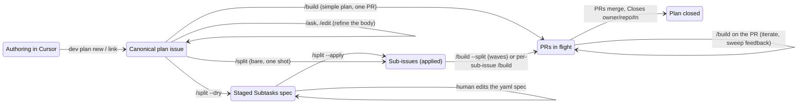

# The plan lifecycle

The end-to-end narrative: how a plan travels from a Cursor session to
merged PRs, and which command moves it at each step. Per-command semantics,
flags, and refusal messages live in [commands.md](commands.md); internals
in [architecture.md](architecture.md).

## The shape of the system

An issue is the canonical plan. The local plan file
(`.cursor/plans/*.plan.md`) is a transient working copy synced by
`dev plan` ([d3mlabs/dev](https://github.com/d3mlabs/dev)); sub-issues are
the plan's decomposition; PRs are the plan's output. The slash commands are
the remote controls that move a plan between those states without leaving
GitHub.

## Step by step

1. **Author in Cursor.** The plan takes shape as a local plan file during a
   planning conversation.
2. **Canonize.** `dev plan new` (start remote-first) or `dev plan link`
   (push an existing file) makes the GitHub issue the single source of
   truth. Repo-local plans live on the repo they concern; org plans
   (meta-plans orchestrating consistency across org areas) live on the org
   plans repo via `--org`. A `Target repos:` line declares intended scope
   for multi-repo plans — optional everywhere, and worth adding whenever
   the plan's work lands outside its own repo.
3. **Refine remotely.** `/ask` and `/edit` on the issue (or from anyone
   reviewing it) evolve the body; `dev plan pull` brings it back to Cursor
   whenever local editing is more comfortable.
4. **Split, in two phases.** `/split --dry` stages the proposal as an
   editable `## Subtasks` yaml section in the plan body — routing
   per-subtask (`repo:`), dependency indices, `existing:` adoptions, and
   Ruby-suggested `# possible match:` comments. The human reviews and edits
   the section like any other body content (it round-trips through
   `dev plan pull/push`). `/split --apply` executes exactly what the
   section says — no agent, no drift between what was reviewed and what
   runs. Bare `/split` does both in one shot when staging review isn't
   needed. At apply, canonicity transfers to the sub-issues and the section
   becomes a linked map.
5. **Build.** Either `/build` on the plan for one whole-plan PR (the
   simple-plan path stays first-class — splitting is a scoping choice for
   blast radius and reviewability, never an obligation), `/build` on
   individual sub-issues, or `/build --split` on the parent to orchestrate
   all of them in dependency waves with a live checklist. Nodes the
   orchestrator cannot drive (intended-repo fallbacks, adopted/referenced
   external issues) are skipped with warnings and their dependents reported
   blocked.
6. **Iterate.** On each PR, review feedback accumulates as threads and
   comments; `/build` on the PR sweeps and addresses it, replying in each
   thread with its disposition and the commit link. Humans resolve threads
   and merge.
7. **Close.** Merged PRs carry `Closes owner/repo#n`, so sub-issues and
   eventually the plan close from the merge record.

## Body conventions

Everything ai-flow reads from or writes into issue bodies, in one place:

| Convention | Where | Written by | Read by |
|---|---|---|---|
| `Target repos: owner/a, owner/b` | plan body | human (or `dev plan new --org` scaffold) | `/split` (narrows the repo menu), `/build` on an issue (first entry picks the code repo) |
| `## Subtasks` + fenced yaml spec | plan body | `/split --dry` | human (edit freely), `/split --apply` (executes it), `/build` (refuses while staged) |
| `## Subtasks` linked map | plan body | `/split` at apply | humans; `/build --split` (adopted/referenced annotations mark undrivable nodes) |
| `existing: owner/repo#n` | spec entry | agent or human | `/split --apply` (adopt parentless / reference parented, never create) |
| `# possible match: owner/repo#n "title"` | spec entry | `/split --dry` (deterministic title search) | human — promote into `existing:` or delete |
| `Depends on: owner/repo#n, …` | sub-issue body | `/split` at apply (always fully qualified) | `/build --split` (wave ordering; open external deps block dependents) |
| `Intended repo: owner/repo` | sub-issue body | `/split` fallback (App not installed on the target) | `/build --split` (skips the node), humans (install the App there, re-run `/split`) |
| `<!-- ai-flow:build #n -->` | PR body | `/build` | Projects automation, humans |

## Where commands run — adoption vs. routing

Receiving sub-issues needs only the ai-flow App installation on a repo;
**running** commands on a repo's own issues additionally needs the caller
workflow and runner access. Non-adopted repos are therefore valid routing
targets for tracking, driven from the parent plan.

**ai-flow itself deliberately does not adopt its own commands**: the
product repo stays command-free so it remains easy to reason about (no
reusable-workflow-plus-caller in one repo, no self-triggering surface).
ai-flow's own plans live on the org plans repo with
`Target repos: d3mlabs/ai-flow`; sub-issues route into ai-flow for tracking
and are driven from the parent.
